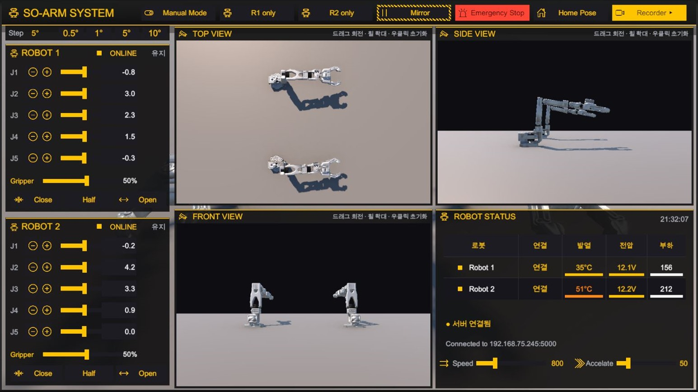
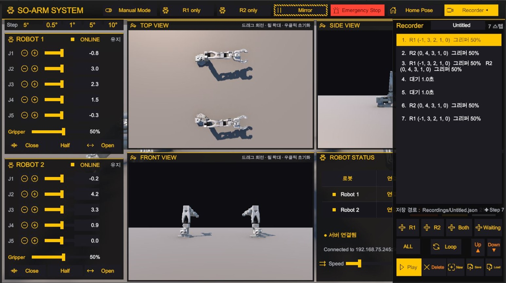
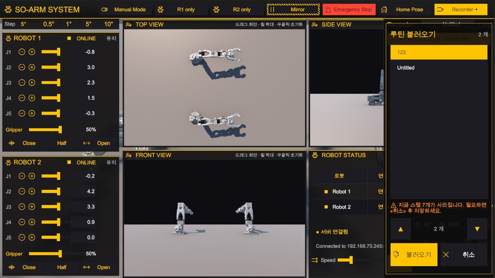

# Smart Factory: Dual SO-ARM101

SO-ARM101 6축 로봇팔 두 대를 Unity 디지털 트윈과 실시간 동기화 제어하는 분산 시스템.
Hugging Face LeRobot 프레임워크 기반이며, Unity(Windows)와 라즈베리파이 서버가
TCP/JSON 프로토콜로 통신한다.

| 항목 | 사양 |
|---|---|
| 로봇 | SO-ARM101 (3D 프린팅, 6-DOF) × 2대 |
| 모터 | Feetech STS3215 × 12개 (12V, 1:345 감속) |
| 그리퍼 | PincOpen (Pollen Robotics, 평행 4절링크) × 2 |
| 컨트롤러 보드 | Waveshare Bus Servo Adapter (A) × 2 |
| 메인 컴퓨터 | Raspberry Pi 4 (4GB, Ubuntu 24.04) |
| Unity 호스트 | Windows PC / Unity 6000.4.3f1 |
| 통신 | TCP Socket (JSON, Port 5000) |

---

## 화면

관제 화면. 왼쪽에 두 로봇의 관절 제어, 가운데에 TOP / SIDE / FRONT 뷰,
오른쪽 아래에 온도·전압·부하 상태표를 뒀다. 각 뷰는 드래그로 돌리고 휠로 확대한다.



Recorder. 자세를 스텝으로 쌓아 하나의 루틴을 만들고, 반복 구간과 대기를 섞어 재생한다.
스텝마다 R1 / R2 / 둘 다를 고를 수 있다.



루틴 불러오기. 저장된 루틴을 골라서 연다.
현재 스텝이 남아 있으면 몇 개가 사라지는지 먼저 알린다.



---

## 기능

### 제어 모드

"어떻게 제어하나"와 "어느 팔을 쓰나"를 분리했다.

| 축 | 값 |
|---|---|
| 제어 방식 | `Independent` (독립) / `Mirror` (동시 동작) |
| 채널 on/off | R1 사용 / R2 사용 (각각 토글) |
| 녹화 | 위 두 축과 직교. 어느 모드에서든 켤 수 있다 |

이전 버전은 `Robot1Only`/`Robot2Only`가 제어 방식과 연결 대상을 겸했다.
"미러로 한 대만 쓰기" 같은 조합이 표현되지 않아 축을 나눴다.

### 수동 모드 (직접교시)

손으로 팔을 끌어다 자세를 가르친다.

- `1번 수동` / `2번 수동`: 해당 로봇의 토크를 풀어 손으로 밀 수 있게 한다
- `미러 수동`: 1번을 손으로 가르치면 2번이 실시간으로 따라 한다

### 모션 녹화 / 재생

가르친 동작을 기억했다가 되돌려 준다.

- 실물 폴링 각도를 시각과 함께 기록하고 원래 속도로 재생
- 재생 속도 0.1~1.5배, 반복재생, JSON 저장/불러오기
- 재생은 스텝 단위로 순차 진행한다. 목표를 던진 뒤 실제 도착과 그리퍼 정지를
  확인하고 다음 스텝으로 넘어간다

### 카티시안 좌표 제어 (역기구학)

관절 각도가 아니라 TCP의 XYZ 좌표로 팔을 민다.

ROBOT 1 / ROBOT 2 카드 제목 옆의 스위치가 그 카드를 조인트 ↔ 카티시안으로 바꾼다.
카드마다 따로 논다. 한쪽은 관절로, 다른 쪽은 좌표로 둘 수 있다.

| 조작 | 값 |
|---|---|
| 이동 | `▲Z+` `▼Z−` `◀Y−` `Y+▶` `↗X+` `↙X−`. 축 이름은 로봇 기준이지 화면 방향이 아니다 |
| 스텝 | 1 / 5 / 10 / 50 mm (기본 5mm) |
| 회전 | `Rx±` `Ry±` `Rz±`, 1회 5°. 공구 축 기준 증분이다 |
| 읽기 | 목표가 실제와 벌어졌을 때 현재 위치로 되돌린다 |

슬라이더가 아니라 방향 버튼인 이유는, 좌표 조작이 "여기서 5mm만 왼쪽"처럼 조금씩 미는
일이 대부분이기 때문이다. 슬라이더는 끝값을 정해야 하고 손이 떨리면 수십 mm가 튄다.

회전을 절대 자세가 아니라 증분으로 받는 이유는 짐벌락이다. 예전 홈 자세의 TCP 자세가
rpy `[90, 87, 90]`이라 pitch가 짐벌락 코앞이고, 절대값을 주면 목표가 현재에서 90°
떨어져 5축으로는 못 만든다. 실측에서 관절이 한계에 박히고 TCP가 272mm 날아갔다.
지금은 `R_target = R_current @ Rz(dz) @ Ry(dy) @ Rx(dx)`로 받는다.

TCP 기준점은 아직 순정 조 끝(`gripper_frame_link`)이다. PincOpen 손끝으로 옮기는 것은
`FR-39`로 남아 있다.

5축이라 위치와 자세를 동시에 다 맞출 수는 없다. 회전은 어느 축이 되는지가 자세에 따라
갈린다.

| 축 | 동작 |
|---|---|
| `Rz` | 어느 자세에서나 안정적 |
| `Ry` | 대체로 되지만 뻗은 자세에서 한계에 걸린 사례가 있다 (실측 5.26mm) |
| `Rx` | 홈 근처에서만 된다 |

`Rx` 회전은 J1(베이스 yaw)로 만들어진다. TCP가 베이스 축 위에 있으면 J1을 돌려도 TCP가
제자리에서 돌지만, 팔이 조금만 펴지면 TCP가 호를 그리며 크게 밀린다.

| 자세 (J2) | TCP X | `Rx−` 밀림 | 판정 |
|---|---|---|---|
| -90 (홈) | 0.039 | 2.10mm | 통과 |
| -75 | 0.104 | 47.91mm | 거절 |
| -45 | 0.223 | 26.04mm | 거절 |
| 0 | 0.316 | 21.96mm | 거절 |

홈 근처에서만 되고 정작 거기서는 쓸 일이 없으니, 실제로 작업할 만한 자세에서는 사실상
항상 막힌다고 보면 된다. 눌러도 반응이 없으면 버그가 아니라 이 한계다.

### 홈 자세

홈은 접힌 자세 `(0, -90, 64, -80, 0)`이고 TCP는 `(0.039, 0, 0.364)`다.
2026-08-04 이전에는 전관절 0°였는데, 팔을 앞으로 쭉 뻗은 자세라 켤 때마다 책상 앞을
크게 쓸었다.

손으로 접어 둔 실물 자세를 그대로 쓸 수는 없었다. `elbow_flex`는 소프트 리밋
(로봇1 70° / 로봇2 64°)을, `wrist_flex`는 하드 리밋(-95°)을 넘는다. 토크가 꺼져 있으면
손으로 거기까지 밀리지만 명령은 못 보낸다. 두 로봇 공통 범위 안에서 가장 접힌 값으로 정했다.

홈 값은 씬의 컨트롤러 4개(로봇1·2 × 시뮬·실물)에 각각 직렬화되어 있다. 손으로 고치면
어긋나므로 Unity 메뉴 `SO-ARM → 홈 포즈 적용`으로 한 번에 맞추고 씬을 저장한다.

### Sim ↔ Real 양방향 동기화

- 실로봇 각도를 30 Hz로 폴링해 Unity 모델에 반영
- Play 직후에는 실물이 진실이다. 실물 자세를 읽기 전까지 명령을 내보내지 않는다

### 안전장치

- 비상정지 (ESC 키 / UI 버튼): 두 로봇 모두 현재 자세로 고정
- 속도 제한 (관절 40°/s, 그리퍼 60%/s): 슬라이더를 확 움직여도 급가속하지 않는다
- 소프트 리밋: 정규화 범위와 분리된 별도 필드
- 그리퍼 펌웨어 위치 리밋: 소프트웨어가 틀려도 모터가 차단한다

카티시안에는 두 겹이 더 있다. 둘 다 실측으로 정했다.

- 회전 드리프트 한계 (서버, 5mm): 회전 요청으로 TCP가 그만큼 넘게 밀리면 결과를 버린다
- 관절 도약 한계 (Unity, 20°): 관절이 한 번에 그만큼 넘게 돌아야 하는 해는 적용하지 않는다
- 목표 앞지르기 방지: 못 닿으면 목표를 실제 자리로 되돌린다

관절 도약 한계는 작업영역 경계에서 솔버가 팔꿈치를 리밋까지 꺾는 다른 자세로 건너뛰기
때문에 필요하다. 실제 팔에서는 어깨가 주저앉는 것으로 보인다. 10°를 넘으면 경고만 띄운다.

앞지르기 방지가 없으면, 못 닿았는데도 누를 때마다 목표가 계속 나가서 위 자세 뒤집힘의
방아쇠가 된다. 못 닿으면 되돌려서 다음 누름이 다시 "지금 자리에서 5mm"가 되게 한다.

---

## 구조

```
Unity UI → DualManager → Manager A/B ─┬→ SimController  (ArticulationBody)
                                      └→ RealController → TCP/JSON
                                                            ↓
                                      Pi Server → LeRobot SDK → SO-ARM101 A/B
```

**Unity Client.** `SmartFactoryUI_v3_4`가 입력을 받아 `SOArmDualManager`로 넘기면,
매니저가 제어 모드에 따라 두 `SOArmManager`로 라우팅한다.
각 매니저는 Sim(Unity)과 Real(실로봇)을 함께 제어하고, 실물에서 올라온 각도를 Sim에 되먹인다.

**Network Bridge.** TCP 소켓 위 JSON. 한 줄에 한 메시지(`\n` 구분).

**Raspberry Pi Server.** `robot_server_dual.py`가 LeRobot의 `FeetechMotorsBus`로
두 대를 제어한다. 모터는 USB `serial-by-id` 경로로 식별해 재연결에도 흔들리지 않는다.

**Inverse Kinematics.** 역기구학은 서버가 푼다. LeRobot 본체(`lerobot/model/kinematics.py`)에
이 로봇용 IK가 이미 있어서, URDF를 그대로 읽고 placo로 푼다. 자매 프로젝트 FR5의 DLS 솔버를
C#으로 이식하는 것보다, 이 하드웨어에 맞춰 유지보수되는 구현을 쓰는 쪽이 낫다.

서버는 계산만 한다. `ik` 명령은 모터를 건드리지 않고 관절 각도만 돌려주고, 적용은 Unity가
`SOArmManager`를 거쳐서 한다. 그래야 속도 제한·소프트 리밋·비상정지·그리퍼 안전 게이트가
그대로 걸린다. 서버가 직접 돌리면 그 방어선을 통째로 우회한다. 녹화 재생과 같은 원칙이다.

기구학 전용 URDF `so101_kin.urdf`를 쓴다. placo(pinocchio)는 URDF에 mesh 참조가 있으면
DAE를 찾다가 적재 자체가 `ValueError`로 실패한다. IK는 관절 축·원점·한계만 있으면 풀리므로
visual/collision을 걷어냈다.

팔 관절은 J1~J5뿐이고 J6은 그리퍼다. J2·J3·J4가 서로 평행한 pitch 축이라 공구의 yaw가
J1에 묶여 임의의 6D 자세를 만들 수 없다. 자세 가중치를 0.01로 낮춰 위치를 맞추고 자세는
근사한다. 회전을 일부러 시킨 요청일 때만 0.6으로 올린다.

라파4에서 solve 1회 0.111ms, 보통 3~4회 수렴. TCP 왕복 포함 1.9ms라 슬라이더를 끌어도
따라온다. 수렴 판정 0.2mm, 최대 40회. 왕복 검증에서 위치오차 0.05mm.

---

## 파일 구성

### Unity (`Assets/Script/`)

| 파일 | 역할 |
|---|---|
| `SOArmJointConfig.cs` / `SOArmPresets.cs` | 관절 설정·프리셋 |
| `ISOArmController.cs` | Sim/Real 공통 인터페이스 |
| `SOArmMotorMapper.cs` | 각도 ↔ 서버값(-100~100) 변환 |
| `SOArmSocketClient.cs` | TCP 소켓 + 응답 콜백 큐 |
| `SOArmSimController.cs` / `SOArmRealController.cs` | 시뮬 / 실로봇 제어 |
| `SOArmManager.cs` / `SOArmDualManager.cs` | 단일 / 이중 로봇 통합 |
| `ControlTowerCanvas.cs` | 관제 화면 (uGUI) |
| `RecordManager.cs` / `RecordProject.cs` / `Waypoint.cs` | 루틴 녹화·재생 |
| `PincOpenCoupling.cs` / `PincOpenSafety.cs` | 그리퍼 4절링크 연동·안전 |
| `SOArmIKController.cs` | 카티시안 조그. 서버에 IK를 청하고 결과를 매니저로 넣는다 |
| `SmartFactoryUI_v3_4.cs` | 구 UI (관제 화면으로 대체) |

### 에디터 도구 (`Assets/Editor/`)

그리퍼 이식·검증 자동화.
`PincOpenSetupMenu` / `PincOpenCapture`(헤드리스 렌더·스윕·기하 리포트) /
`PincOpenMainSceneMigrator`(배선 보존 서브트리 이식) / `JointLimitFixer` / `GripperInvertFixer`

`HomePoseSetup`은 홈 값을 씬의 컨트롤러 4개에 한 번에 적용한다.
리밋 밖 값이면 조용히 자르지 않고 어느 관절인지 경고한다.

### 라즈베리파이 (`raspberry_pi/`)

| 파일 | 역할 |
|---|---|
| `robot_server_dual.py` | TCP 서버 본체. 명령 해석 → LeRobot SDK → 모터 |
| `start_server.sh` | 서버 기동/재기동 |
| `arm_set_home.py` | 팔 관절 0점 재정의 |
| `teach_torque.py` | 직접교시용 토크 조절 |
| `pincopen_apply_manual.py` | 눈으로 확인한 그리퍼 양 끝을 캘리브+펌웨어에 기록 |
| `pincopen_calibrate_gripper.py` | 그리퍼 대화식 캘리브레이션 |

IK가 읽는 기구학 전용 URDF는 라파의 `/home/sw/ik/so101_kin.urdf`에 있고 저장소에는 없다.

### 문서

| 경로 | 내용 |
|---|---|
| [`docs/SETUP.md`](docs/SETUP.md) | 설치 가이드. 라파 초기 설정부터 Unity 씬 구성까지 |
| [`CONTRIBUTING.md`](CONTRIBUTING.md) | 브랜치 전략, 커밋 규칙, 코드 스타일 |
| [`CHANGELOG.md`](CHANGELOG.md) | 버전별 변경 이력 |
| [`docs/TASK_QUEUE.md`](docs/TASK_QUEUE.md) | 작업 큐 기능 명세. 구현 전 단계 |
| `docs/spec/` | 표준 스펙. User/System Requirement, H/W·S/W Architecture |
| `docs/` | 장문 엔지니어링 문서. 요구사항, HW·SW 아키텍처, PincOpen 이식기 |
| `docs/v2/` | 위 문서의 Confluence 형식 판 |

저장소에는 계속 쓰는 구현만 둔다.
로그·크래시 복구본·압축 백업·일회성 스크립트는 `.gitignore`로 제외한다.
한 번 커밋된 것은 히스토리에 남으므로 필요하면 꺼낼 수 있다.

---

## 통신 프로토콜

한 줄 = 한 JSON 메시지.

| `type` | 용도 | 필드 |
|---|---|---|
| *(없음)* | 모터 이동 | `mode`, `motor`, `value` (-100~100) |
| `get` | 현재 각도 조회 | `mode` |
| `torque` | 토크 ON/OFF | `mode`, `enable` |
| `teach` | 수동 모드 | `mode`, `enable` |
| `set_speed` | 속도/가속도 | `mode`, `velocity`, `acceleration` |
| `ik` | 역기구학 (계산만) | `current` (관절 5개), `target` (`[x,y,z]` m), `rot_delta`, `orientation_weight` |
| `fk` | 순기구학 | `joints` (관절 5개) |
| `home` | 홈 이동. 쓰지 않는다 | `mode` |
| `set_home` | 현재 자세를 새 0점으로 | `mode`, `confirm` |
| `status` | 온도·전압·부하 요약 | `mode` |
| `temp_detail` | 모터별 온도와 서보 설정 한계 | `mode` |

`ik`는 관절값만 돌려주고 모터는 건드리지 않는다. 실제 이동은 Unity가 기존 이동 명령으로
하므로 속도 제한·소프트 리밋·비상정지가 그대로 걸린다.

`home`은 무조건 전관절 0°로 보낸다. 홈이 접힌 자세로 바뀐 뒤로는 그게 홈이 아니라서
Unity는 쓰지 않고 `GoToHome()`으로 간다.

`mode`: `robot1` / `robot2` / `both` / `mirror`
`motor`: `shoulder_pan` / `shoulder_lift` / `elbow_flex` / `wrist_flex` / `wrist_roll` / `gripper`

---

## 실행

### 라즈베리파이 (서버)

```bash
bash /home/sw/start_server.sh        # 재기동 + 로그/포트 확인까지 한 번에
```

직접 띄우려면:

```bash
source ~/lerobot-env/bin/activate
pkill -9 -f robot_server_dual.py     # -9 여야 한다. 아래 참고
python robot_server_dual.py
```

주의: `pkill`(SIGTERM)은 서버의 종료 핸들러를 깨워 `disable_torque()`를 호출한다.
그러면 12V 팔이 중력으로 주저앉는다. 반드시 `-9`로 죽여 토크를 유지할 것.
`start_server.sh`도 같은 이유로 `-9`를 쓴다.

주의: 라즈베리파이 IP는 자주 바뀐다. 연결이 안 되면 라파에서 `hostname -I`로 확인하고,
PC와 같은 대역인지 먼저 볼 것. 다른 공유기에 붙어 있으면 라우팅이 없어 닿지 않는다.

### Unity (클라이언트)

1. URDF Importer 설치 후 `Assets/SO101_unity/so101.urdf` 임포트
2. `Robot1_Group` / `Robot2_Group` 구성 후 Play
3. Player Settings의 Run In Background를 반드시 켤 것.
   꺼져 있으면 창이 비활성일 때 Editor가 멈춰 통신이 끊긴 것처럼 보인다

---

## 직접교시 사용법

```
1. 수동 모드 ON   →  회전축·손목 토크가 풀린다
2. 녹화
3. 손으로 동작을 보여준다
4. 정지  →  수동 모드 OFF (토크 복구)
5. 재생
```

### 왜 토크를 낮추지 않고 끄는가

STS3215는 1:345 감속기라 역구동이 구조적으로 안 된다.
`Torque_Limit`을 500에서 192(38%)까지 내려도 손으로 꺾이지 않았다.
모터가 힘을 안 줘도 기어 마찰 자체가 남기 때문이다. 끄는 것 말고는 방법이 없다.

그런데 다 끄면 팔이 주저앉는다. 그래서 중력 모멘트가 없는 관절만 끈다.

| 관절 | 수동 모드 | 이유 |
|---|---|---|
| `shoulder_pan` | 토크 OFF | 수직축 회전이라 중력 토크 0 |
| `wrist_roll` | 토크 OFF | 툴 축 회전이라 중력 토크 ≈ 0 |
| `wrist_flex` | 토크 OFF | 그리퍼만 든다 |
| `shoulder_lift` | 유지 | 팔 전체 무게를 든다 |
| `elbow_flex` | 유지 | 전완 + 그리퍼 |

토크를 유지하는 관절은 한계값도 낮추지 않는다. 낮추면 중력을 이기고 팔을 들어올릴
힘이 모자라 올라가는 도중 스톨한다. 내려가는 쪽은 중력이 도와 잘 가므로
"특정 각도에서 락 걸린 것처럼" 보인다.

Unity 쪽 `teachMode`도 함께 켜진다. 안 켜면 옛 목표가 계속 나가서
손을 뗀 순간 제자리로 튕겨 돌아간다.

---

## 캘리브레이션 노트

LeRobot 0점과 URDF 0점은 다르다. 이 차이가 "시뮬과 실물이 안 맞는" 문제의 근원이었다.
LeRobot의 `RANGE_M100_100`에서 norm 0은 항상 가동범위의 중앙이다.

```
norm = ((raw − range_min) / (range_max − range_min)) × 200 − 100
```

`Present_Position = Actual − Homing_Offset`은 모터 펌웨어가 적용한다.
따라서 0점을 옮기려면 `Homing_Offset`을 쓰고, 직후에 `Goal_Position`을 현재 위치로
다시 써야 한다. 안 그러면 모터가 옛 목표를 새 좌표계로 재해석해 스스로 움직인다.

그리퍼는 자동 탐색이 실패했다. STS3215의 약 20틱 불감대를 스톨 판정이
기계적 스토퍼로 오인해, 캠이 최대 닫힘을 지나 되벌어지는 구간까지 범위에 넣었다.
결국 눈으로 확인한 양 끝을 수동으로 기록하는 방식(`pincopen_apply_manual.py`)으로 갔다.

---

## 트러블슈팅

### 로봇 · 통신

| 이슈 | 원인 | 해결 |
|---|---|---|
| 서버 재시작할 때마다 두 팔이 떨어짐 | `start_server.sh`의 `pkill`(SIGTERM)이 종료 핸들러를 깨워 `disable_torque()` 호출 | `pkill -9`. 핸들러를 건너뛰면 모터가 토크 유지 |
| 손으로 밀어도 안 꺾임 (직접교시) | STS3215는 1:345 감속이라 역구동 불가. `Torque_Limit` 500→192(38%)까지 내려도 소용없음 | 낮추지 말고 끌 것. 단 중력 부하 없는 관절만 |
| 라파에 접속 안 됨, ping도 실패 | PC와 다른 대역에 붙음 (75번 vs 45번). 라우팅이 없어 원천적으로 불가 | IP만 보지 말고 대역 확인. 같은 Wi-Fi로 |
| 통신이 멈춤 / 트래픽 0 | Run In Background 꺼짐. 창이 비활성이면 Editor가 정지 | Player Settings에서 켜기 |
| 폴링이 영구 정지 | 각도 응답 유실 시 대기 타임아웃 없음 | 1초 타임아웃 + 재요청 |
| Editor 프리징 | `Debug.Log`가 초당 360회 | 로그를 플래그 뒤로 |
| 스크립트 종료만 해도 팔이 처짐 | `bus.disconnect()`가 `disable_torque()` 호출 | `bus.port_handler.closePort()` 사용 |
| 리밋을 좁혔더니 전 각도가 어긋남 | `maxAngle`이 정규화 스케일도 겸함 | 소프트 리밋 필드 분리 |
| 그리퍼가 닫혔다 다시 열림 | 두 곳에서 명령을 씀 | 전송 경로를 하나로 통합 |
| `Present_Load` 과부하 오판 | 10비트 2의 보수 (964 = −60) | `if v > 511: v -= 1024` |
| URDF NullReferenceException | STL Convex Mesh 생성 실패 | STL → DAE + Collision 주석 |
| 모델이 분홍색 | URP 머티리얼 미적용 | Render Pipeline → URP 변환 |
| 임포트 후 관절이 안 움직임 | `stiffness = 0` | `ConfigureDrives()` |
| Address already in use | 이전 서버 잔존 | `pkill -9 -f robot_server_dual.py` 후 2초 대기 |
| PyTorch Illegal Instruction | ARM 비호환 빌드 | ARM CPU 빌드 사용 |
| 속도 설정이 안 먹는데 로그는 성공 | `Max_Velocity`는 sts3215에 없는 레지스터. 예외를 `try/except`가 삼킴 | `Goal_Velocity`로 변경. 되읽어 확인할 것 |
| 서버를 켜면 팔이 스스로 움직임 | 기동 경로가 `enable_torque()` 전에 `Goal_Position`을 현재 위치로 안 맞춤 | 켜기 전 현재 위치로 동기화 (`handle_teach`와 동일 방식) |
| 수동모드인데 그리퍼가 손으로 안 벌어짐 | 그리퍼도 1:345 감속이라 역구동 불가. 팔 관절과 같은 이유 | 풀지 말 것. `TEACH_FREE`에서 빼고 슬라이더로만 조작 |
| 수동모드에서 J2/J3가 일정 각도 이상 안 올라감 | 교시용 토크 한계를 낮춰 중력을 이길 힘이 부족. 더해서 Unity가 토크 유지 관절의 목표까지 실물 위치로 덮어씀 | `TEACH_HOLD` 비우고, 실제로 토크가 풀린 관절만 목표 채택 |
| 루틴 재생이 스텝을 건너뜀 | 목표만 던지고 고정 시간만 대기. 팔이 도착하기 전에 다음 목표가 덮어씀 | 실제 도착 확인 후 진행 |
| 재생 중 그리퍼가 닫히면서 팔이 출발함 | 도착 판정에서 그리퍼를 제외했더니 아무도 안 기다림 | 그리퍼는 "값이 더 안 변할 때"로 종료 판정 |
| 프리셋의 `homeAngle`을 고쳤는데 홈이 그대로 | `joints`가 public 직렬화 필드라 씬 값이 이김. `SOArmPresets`는 배열이 비었을 때만 타는 fallback | `SO-ARM → 홈 포즈 적용` 메뉴로 씬에 적용 후 저장 |
| 화면마다 홈 자세가 다름 | 관제 화면은 `GoToHome()`(homePose), 구 UI는 서버 `type:"home"`(전관절 0°)을 씀 | 경로를 `GoToHome()`으로 통일 |
| 회전 조그를 눌러도 아무 반응이 없음 | 5축이라 그 자세에서 안 되는 회전. 서버가 `rot_drift`로 거절 중 | 버그 아님. `Rz`를 쓰거나 자세를 바꿀 것 |

2026-08-02 세션의 상세 경위와 재현 방법은
[`docs/TROUBLESHOOTING_2026-08-02.md`](docs/TROUBLESHOOTING_2026-08-02.md)에 있다.

### 개발 환경 (Windows)

| 이슈 | 원인 | 해결 |
|---|---|---|
| `.gitignore`에 `*.json` → 클론한 쪽에서 프로젝트가 안 열림 | `Packages/manifest.json`이 빠져 패키지 복원 실패 | 캘리브레이션 파일만 지정해서 무시 |
| 추적 해제한 파일이 다음 커밋에 다시 들어옴 | `git add <디렉터리>`는 무시 규칙 없는 파일을 다시 추가 | `git rm --cached`만으론 부족. `.gitignore`에 못박기 |
| PowerShell 스크립트에서 한글이 깨지고 줄바꿈까지 사라짐 | PS 5.1은 BOM 없는 `.ps1`을 ANSI로 읽음. `//` 주석 뒤 개행이 먹혀 다음 JS 줄이 주석 처리됨 | 스크립트를 ASCII로 쓰거나 BOM 포함 저장 |
| Chrome 헤드리스 캡처에 여백이 대부분 | `--screenshot`은 창 전체를 찍음 (5100×4200 중 다이어그램은 900px) | 캡처 후 흰 여백 자동 크롭 |
| PDF에서 텍스트 추출 실패 | 서브셋 폰트라 문자열이 글리프 인덱스여서 사람이 읽을 수 없음 | 원본(Confluence 등)에서 받거나 이미지로 읽기 |

---

## 진행 상태

- [x] 기본 제어 (독립 / 미러)
- [x] Sim ↔ Real 양방향 동기화
- [x] PincOpen 그리퍼 이식 + 실측 캘리브레이션
- [x] 비상정지 · 속도 제한 · 소프트 리밋
- [x] 관절 0점 재정의 (`set_home`)
- [x] 수동 모드 (직접교시)
- [x] 모션 녹화 / 재생 (JSON)
- [x] 관제 화면 (Control Tower)
- [x] 카티시안 좌표 제어 (역기구학 IK) — `SR_20` / `FR-38`
- [ ] 협동 작업 (Pick & Place 전달) — `SR_19` / `FR-22`
- [ ] 작업 큐 관리 UI — `SR_21` / `FR-42`~`FR-48`. 명세 완료([`docs/TASK_QUEUE.md`](docs/TASK_QUEUE.md)), 구현 미착수
- [ ] 카메라 비전 통합 — `SR_18` / `FR-37`

### 알려진 이슈

- 로봇2 그리퍼 행정이 112°로 로봇1(154°)보다 짧다. 서보 혼 스플라인 또는 4절링크 조립 차이로 추정
- 로봇2 `wrist_flex` 0점에 약 10.5° 잔차
- 라즈베리파이 IP가 문서·코드·씬에서 서로 다르게 기록되어 있다. 설정 1곳으로 일원화 필요
- `elbow_flex` 소프트 리밋이 로봇마다 다른데(70° / 64°) 근거가 문서·커밋 어디에도 없다
- 카티시안 UI에 `Rx` 버튼이 그대로 있다. 대부분 거절당하므로 지우거나 비활성 표시할지 미정
- 카티시안 TCP가 순정 조 끝 기준이라 PincOpen 손끝과 다르다 (`FR-39`)
- `so101_kin.urdf`가 라파에만 있고 저장소에 없다. 라파를 다시 만들면 IK가 죽는데 복원할 원본이 없다

---

## 참고 자료

- [SO-ARM100/101](https://github.com/TheRobotStudio/SO-ARM100)
- [LeRobot (Hugging Face)](https://github.com/huggingface/lerobot)
- [PincOpen (Pollen Robotics)](https://github.com/pollen-robotics/PincOpen)
- [Unity URDF Importer](https://github.com/Unity-Technologies/URDF-Importer)
- [Fairino Collaborative Robot Manual](https://fairino-doc-en.readthedocs.io/) — 티칭·재생 UX 참고

인터페이스 설계는 자매 프로젝트
[Fairino FR5 Digital Twin](https://github.com/kimar1022-code/fairino-fr5-digital-twin)을 참고했다.

## 라이선스

코드는 MIT License를 따른다.
SO-ARM100/101 하드웨어는 Apache 2.0 (TheRobotStudio), LeRobot은 Apache 2.0 (Hugging Face),
PincOpen은 Apache 2.0 (Pollen Robotics).
