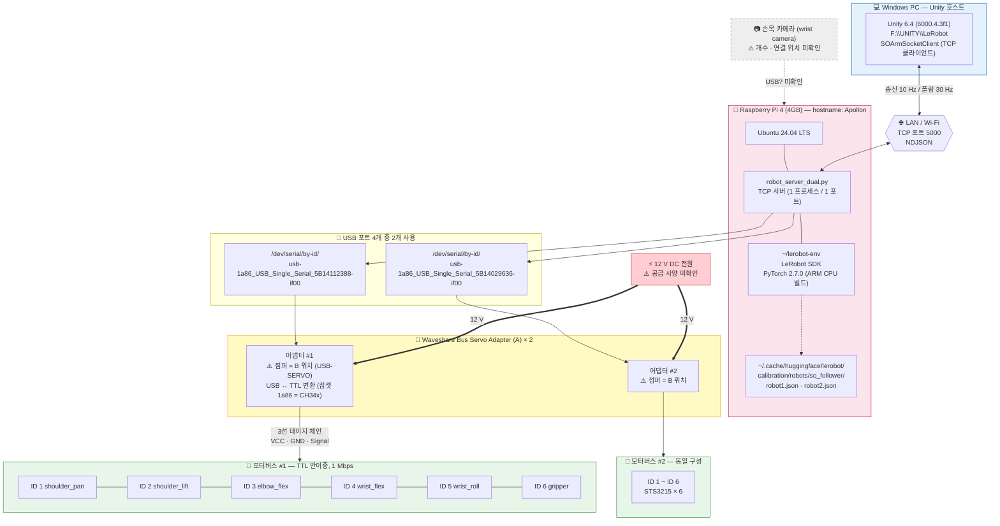
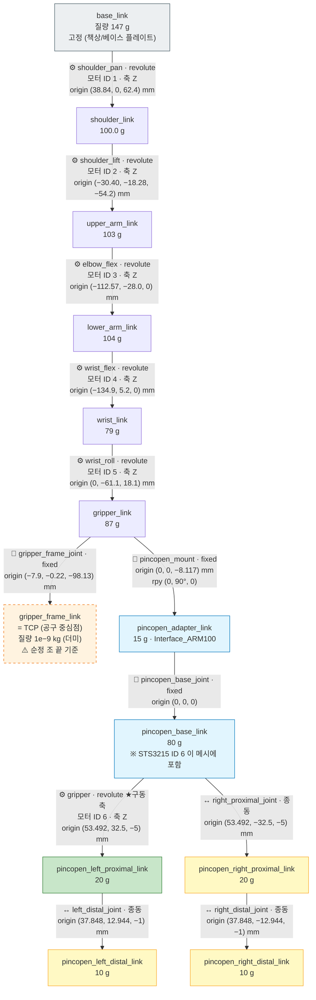
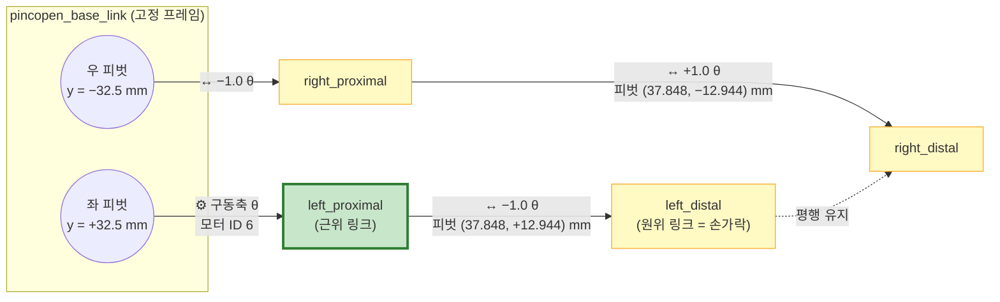
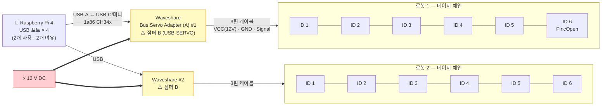
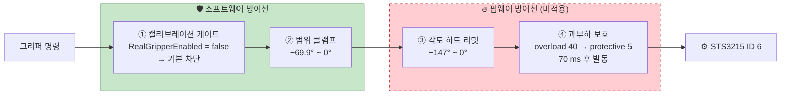

# 하드웨어 아키텍처 — SO-ARM101 스마트팩토리

> **작성일: 2026-08-01**
> 이 문서는 **"어떤 부품이 어떤 선으로 이어져 있고, 각 관절이 어디까지 움직일 수 있는가"** 를 실측·문헌 출처와 함께 정리한 문서다.

---

## 0. 이 문서의 근거와 표기 규칙

### 0.1 출처 표기

모든 수치 뒤에 **어디서 나온 값인지**를 붙였다.

| 표기 | 뜻 |
|---|---|
| `URDF` | `F:\UNITY\LeRobot\Assets\SO101_unity\so101.urdf` 에서 직접 읽음 |
| `SCENE` | `F:\UNITY\LeRobot\Assets\Scenes\LeRobot.unity` 직렬화 값 |
| `공식 노트북` | PincOpen 저장소 `flash_and_tests/flash_test.ipynb` (`PINCOPEN_INTEGRATION` §7 인용) |
| `ROS2 xacro` | CNURobotics `urdf/gripper_macros.xacro` (`PINCOPEN_INTEGRATION` §7 인용) |
| `STL 실측` | 메시 파일을 직접 파싱해 경계값을 잰 결과 (`PINCOPEN_INTEGRATION` §1~2) |
| `HANDOFF` | `C:\Users\snbco\Desktop\HANDOFF.md` |
| `PROJECT_NOTES.md` | `F:\UNITY\LeRobot\PROJECT_NOTES.md` |
| ⚠️ **미확인** | 확인하지 못함. 추측으로 채우지 않았음 |

### 0.2 단위

- 길이: **mm** (URDF 원본은 m 단위이므로 ×1000 해서 표기)
- 각도: **도(°)** (URDF 원본은 rad이므로 ×180/π 해서 표기, 원본 rad도 병기)

---

## 1. 물리 구성도

### 1.1 쉬운 설명

신호가 흘러가는 순서는 **"멀리서 가까이"** 다.

```
Windows PC (Unity)      ← 사람이 조작하는 곳
   │ 네트워크 케이블/Wi-Fi
라즈베리파이 4          ← 명령을 번역하는 곳 (두뇌)
   │ USB 케이블 2개
Waveshare 어댑터 2개    ← 신호 전압을 바꾸는 곳 (통역사)
   │ 3선 버스 케이블 (데이지 체인)
STS3215 모터 12개       ← 실제로 도는 곳 (근육)
```

### 1.2 구성도



### 1.3 "왜 어댑터가 필요한가"

PC/라즈베리파이의 USB는 **USB 프로토콜**로 말하고, 모터는 **TTL 시리얼**로 말한다.
언어가 달라 직접 못 붙인다. Waveshare 어댑터가 그 사이에서 **통역**을 한다.

또 하나 중요한 점: STS3215는 **반이중(half-duplex) 1선 통신**이다.
말하는 선과 듣는 선이 같아서, 보낼 때와 받을 때 방향을 전환해야 한다.
어댑터가 이 전환을 담당한다. — ⚠️ 어댑터 내부 회로 세부는 미확인, 일반적인 버스 서보 어댑터 동작 기준

---

## 2. 부품 목록 (BOM)

| 분류 | 부품 | 수량 | 사양 | 출처 |
|---|---|---:|---|---|
| 로봇팔 | SO-ARM101 | 2 | 3D 프린팅, 6-DOF, 조립 완료 | `HANDOFF` §1 |
| 액추에이터 | Feetech **STS3215** | 12 | 12 V, TTL 시리얼, baudrate **1,000,000**, 모델번호 **777** | `HANDOFF` §1 |
| 인터페이스 | Waveshare Bus Servo Adapter (A) | 2 | USB ↔ TTL, 점퍼 **B 위치 필수** | `HANDOFF` §1 |
| 제어 컴퓨터 | Raspberry Pi 4 | 1 | 4 GB RAM, Ubuntu 24.04 LTS, hostname `Apollon`, USB 4포트 | `HANDOFF` §1 |
| 호스트 | Windows PC | 1 | Unity 6.4 (6000.4.3f1) | `HANDOFF` §1 |
| 엔드이펙터 | **PincOpen** 그리퍼 | ⚠️ | 평행 4절 링크. Pollen Robotics, CC BY-SA 4.0 | `PINCOPEN_INTEGRATION` |
| 결합부 | Interface_ARM100 어댑터 | ⚠️ | 두께 **8.117 mm** × 51 × 24 mm | `STL 실측` |
| 센서 | 손목 카메라 | ⚠️ | RoboSEasy SO-ARM 키트 카메라 (USB 웹캠 추정) | `HANDOFF` §1 |
| 전원 | 12 V DC | ⚠️ | 전류 용량·어댑터 모델 미확인 | `HANDOFF` §1 |

> ⚠️ PincOpen 그리퍼의 **실물 장착 대수**(1대만? 2대 다?)는 확인하지 못했다.
> Unity 씬에는 **2대 모두** 이식되어 있다 (`PINCOPEN_INTEGRATION` §9).

---

## 3. 기구 구조 — 6-DOF 링크 체인

### 3.1 링크 체인 (URDF 기준)



- 🟩 **초록** = 모터가 직접 도는 축 (구동축)
- 🟨 **노랑** = 기계적으로 따라 도는 축 (종동축) — 소프트웨어가 미러링

### 3.2 관절별 모터 ID / 가동범위 표

| 관절 | 모터 ID | URDF 조인트명 | 축 | URDF 리밋 (rad) | 환산 (°) | 씬 설정값 (°) | 비고 |
|---|:---:|---|:---:|---|---|---|---|
| 베이스 좌우 회전 | **1** | `shoulder_pan` | Z | −1.91986 ~ 1.91986 | −110.00 ~ 110.00 | −110 ~ 110 ✅ | |
| 어깨 상하 | **2** | `shoulder_lift` | Z | −1.74533 ~ 1.74533 | −100.00 ~ 100.00 | −100 ~ 100 ✅ | |
| 팔꿈치 | **3** | `elbow_flex` | Z | −1.69 ~ 1.69 | −96.83 ~ 96.83 | −96.8 ~ 96.8 ✅ | 5° 캘리브 오프셋이 URDF에 반영됨 (`PROJECT_NOTES.md`) |
| 손목 상하 | **4** | `wrist_flex` | Z | −1.65806 ~ 1.65806 | −95.00 ~ 95.00 | −95 ~ 95 ✅ | |
| 손목 회전 | **5** | `wrist_roll` | Z | −2.74385 ~ 2.84121 | −157.21 ~ 162.79 | −157.2 ~ 162.8 ✅ | **비대칭** |
| 그리퍼 (PincOpen) | **6** | `gripper` | Z | −1.22 ~ 0 | −69.90 ~ 0 | −69.9 ~ 0 ✅ | ⚠️ 이 값은 **손가락 각도**, 모터 각도 아님 |

> **홈 포즈: 모든 관절 0°** — LeRobot 캘리브레이션이 "가운데 = 0" 으로 잡기 때문 (`HANDOFF` §5).
> 단, PincOpen J6의 홈은 `FingerOpenDeg = 0°` = **열림** 상태다 (`SOArmPresets.cs`).

> ⚠️ 모든 revolute 조인트의 `effort=10`, `velocity=10` 은 **URDF 기본값**이며,
> STS3215의 실제 정격 토크·속도와 대응하지 않는다. 동역학 계산에 쓰지 말 것.

### 3.3 링크 치수 — 조인트 원점 간 거리

URDF의 `<joint><origin xyz>` 벡터 크기를 계산한 값이다.

| 구간 | origin 벡터 (mm) | 거리 (mm) | 의미 |
|---|---|---:|---|
| base → shoulder | (38.84, 0, 62.4) | **73.50** | 베이스 높이 |
| shoulder → upper_arm | (−30.40, −18.28, −54.2) | **64.78** | 어깨 오프셋 |
| upper_arm → lower_arm | (−112.57, −28.00, 0) | **116.00** | **상완 (upper arm)** |
| lower_arm → wrist | (−134.90, 5.20, 0) | **135.00** | **전완 (forearm)** |
| wrist → gripper_link | (0, −61.10, 18.10) | **63.73** | 손목 |
| gripper_link → TCP | (−7.90, −0.22, −98.13) | **98.44** | 순정 조 길이 |

**대략적 최대 도달거리(reach) 추정**: 73.5 + 64.8 + 116.0 + 135.0 + 63.7 + 98.4 ≈ **551 mm**
> ⚠️ 이는 모든 링크를 일직선으로 폈을 때의 **산술 합**이다.
> 관절 리밋 때문에 실제로 이 자세는 나오지 않으므로 **상한값**으로만 참고할 것.
> 정확한 작업 영역(workspace)은 순기구학(FK) 계산이 필요하며, **미수행**이다.

### 3.4 질량 (URDF `<inertial><mass>`)

| 링크 | 질량 (g) |
|---|---:|
| `base_link` | 147.0 |
| `shoulder_link` | 100.0 |
| `upper_arm_link` | 103.0 |
| `lower_arm_link` | 104.0 |
| `wrist_link` | 79.0 |
| `gripper_link` | 87.0 |
| **팔 본체 소계** | **620.0** |
| `pincopen_adapter_link` | 15.0 |
| `pincopen_base_link` | 80.0 |
| `left/right_proximal` | 20.0 × 2 |
| `left/right_distal` | 10.0 × 2 |
| **그리퍼 소계** | **155.0** |
| **합계 (팔 1대)** | **≈ 775 g** |

> ⚠️ **PincOpen 부품의 질량·관성(inertia)은 형상 크기에 맞춘 대략값이다.**
> MJCF 원본이 명백한 임시값이라 쓰지 않았다고 URDF 주석(L331~332)에 명시되어 있다.
> **동역학 계산(중력 보상, 토크 예측)에 쓰지 말 것.**

---

## 4. PincOpen 그리퍼 상세

### 4.1 왜 PincOpen 으로 바꿨나

순정 SO-ARM101 그리퍼(`moving_jaw_so101_v1`)는 한쪽 조만 움직이는 단순 구조다.
**PincOpen** 은 평행 4절 링크라 **두 손가락이 항상 평행하게** 맞물린다.
평행하게 물면 물체가 미끄러지거나 회전하지 않아 pick & place에 유리하다.

### 4.2 Interface_ARM100 어댑터 — 8.117 mm

SO-ARM101과 PincOpen은 원래 결합 규격이 다르다. 그 사이를 메우는 3D 프린팅 부품이 **Interface_ARM100** 이다.

| 항목 | 값 | 출처 |
|---|---|---|
| 두께 | **8.117 mm** | `STL 실측` (원본 CAD X 범위 `−61.609 ~ −53.492` mm) |
| 폭 × 높이 | 51 × 24 mm | `URDF` L367 |
| 질량(URDF) | 15 g | `URDF` L374 |

**⭐ 자동 정렬이 되는 이유 (조정 불필요):**

어댑터 X 최대값 `−53.492` 와 PincOpen 조인트 원점 `0.053492` (= 53.492 mm)가 **정확히 같은 수**다.
즉 MuJoCo 팀이 `base` 메시를 재중심화할 때 쓴 기준면이 **어댑터 결합면**이었다.

→ 어댑터를 **+53.492 mm** 평행이동하면 `−8.117 ~ 0` 이 되어 base 뒷면(`x=0`)과 정확히 맞물린다.
이 평행이동은 **DAE 변환 시 메시에 미리 구워넣었다.** 따라서 아래 두 값은 **0이 맞고 건드리면 안 된다.**

```
pincopen_adapter_link 의 visual origin = 0 0 0
pincopen_base_joint   의 origin        = 0 0 0
```

### 4.3 장착 좌표 유도 (추측 아님)

```xml
<joint name="pincopen_mount" type="fixed">
  <origin xyz="0 0 -0.008117" rpy="0 1.5708 0"/>
  <parent link="gripper_link"/>
  <child  link="pincopen_adapter_link"/>
</joint>
```

| 항목 | 유도 근거 |
|---|---|
| 회전 `rpy="0 1.5708 0"` (Y축 +90°) | 순정 TCP(`gripper_frame_joint`)가 `z = −0.0981` → 공구 방향은 `gripper_link` 의 **−Z**. PincOpen은 **+X** 가 손가락 방향. **+X를 −Z로 보내는 회전 = Y축 +90°** |
| 이동 `z = −0.008117` | 어댑터 두께 8.117 mm 만큼 뒤로 물림 |

### 4.4 검증 결과

| 항목 | 측정 | 판정 |
|---|---|:---:|
| 어댑터 두께 | 8.1 mm | STL 실측 8.117 mm 과 일치 ✅ |
| PincOpen base 크기 | 98.6 × 59.4 × 57.5 mm | 실물 치수 일치 ✅ |
| 손목 ↔ 어댑터 빈틈 | **0.0 mm** (접촉) | ✅ |
| 좌우 정렬 | 대칭 | ✅ |
| 커플링 자동 연결 | 5개 링크 전부 | ✅ |

> ⚠️ `pincopen_mount` 오프셋은 **렌더링 기준 검증만** 했고, 자로 재보지 않았다 (`PINCOPEN_INTEGRATION` §10).

### 4.5 평행 4절 링크 구조



**커플링 배율 (2026-08-01 확정, `MJCF_Full` 프리셋):**

```
left_distal    = θ × (−1.0)
right_proximal = θ × (−1.0)
right_distal   = θ × (+1.0)
```

**렌더링 교차검증**: ×1.0 에서만 손가락 패드가 서로 **평행**하게 맞물린다.
×0.5 는 끝만 뾰족하게 모인다. PincOpen은 평행 4절 링크이므로 ×1.0이 정답.

### 4.6 ⭐ 모터 각도 vs 손가락 각도 — 반드시 구분할 것

> **이 프로젝트에서 가장 헷갈리기 쉬운 지점이다.**

같은 그리퍼를 두 가지 각도로 말할 수 있다.

| | **모터 각도** | **손가락 각도 (구동축)** |
|---|---|---|
| 무엇 | STS3215 ID 6이 실제로 도는 각도 | URDF `gripper` 조인트 = `left_proximal` 이 도는 각도 |
| 열림 | **−140°** | **0°** |
| 닫힘 | **0°** | **−69.9°** |
| 하드 리밋 | **−147°** | (해당 없음) |
| 가동폭 | 140° | **69.9°** (= 1.22 rad) |
| 출처 | `공식 노트북` `set_goal_position(-140)` / `set_min_angle_limit(-147)` | `ROS2 xacro` mimic 리밋 1.22 rad |
| 부호 확정 근거 | — | 렌더링 검증 (**음수 = 닫힘**) |

**관계식:** 모터 `M = −2θ` (θ = 손가락 각도)
→ 손가락 −69.9° 일 때 모터 +139.8° ≈ 공식값 140°와 일치. 두 문헌이 서로 맞물린다.

**왜 2배인가:** 구동축이 모터축이 아니라 왼쪽 proximal 이고, 이 관절 자체가 이미 모터의 −0.5배이기 때문이다.
ROS2 xacro는 네 관절을 전부 *모터축* 기준으로 ±0.5배로 적는데, 우리 URDF는 *proximal* 기준이라 ×1.0이 된다.
**둘은 모순이 아니라 기준 관절이 다른 것이다.**

### 4.7 손가락 간격 실측 (코드 자체검증)

`Tools ▸ SO-ARM ▸ 그리퍼 구동 자체검증` 실행 결과 (`PINCOPEN_INTEGRATION` §7):

| 명령 % | 구동축 각도 | 손가락 간격 |
|---:|---:|---:|
| 100 % (완전 열림) | 0.0° | **94.6 mm** |
| 75 % | −17.5° | 74.4 mm |
| 50 % | −35.0° | 53.9 mm |
| 25 % | −52.4° | 35.2 mm |
| 0 % (완전 닫힘) | −69.9° | **22.9 mm** |
| 150 % (범위 초과 입력) | **0.0° 로 잘림** ✅ | — |

> **파지 가능 물체 크기: 대략 23 ~ 95 mm** (손가락 안쪽 면 기준)

### 4.8 🔴 모터 중복 렌더링 제거

PincOpen `base` 메시 안에 **STS3215(ID 6)가 이미 포함**되어 있다.
순정 `gripper_link` 의 `sts3215_03a_v1` 을 그대로 두면 화면에 모터가 두 개로 보인다.
실물은 하나이므로 순정 쪽을 **주석 처리**했다 (삭제 아님 — 되돌릴 수 있게).

씬 마이그레이션 시에는 `sts3215_03a_v1` 과 `wrist_roll_follower_so101_v1` 시각 메시를 제거한다
(`PincOpenMainSceneMigrator.RemoveVisualChild()`).

---

## 5. 전원 · 배선 · 포트

### 5.1 전원

| 항목 | 값 | 출처 |
|---|---|---|
| 모터 구동 전압 | **12 V DC** | `HANDOFF` §1 |
| 전류 용량 | ⚠️ **미확인** | — |
| 전원 어댑터 모델 | ⚠️ **미확인** | — |
| 라즈베리파이 전원 | ⚠️ **미확인** (별도 USB-C 추정) | — |
| 전원 인가 순서 | ⚠️ **미확인** | — |

> ⚠️ **12 V 계통과 라즈베리파이 5 V 계통의 GND 공통 연결 여부는 확인하지 못했다.**
> 시리얼 통신에서 GND가 분리되면 통신이 불안정해지므로 실물 확인이 필요하다.

### 5.2 통신 배선



**데이지 체인(daisy chain)** 이란 부품을 한 줄로 줄줄이 이어 붙이는 배선 방식이다.
STS3215는 입출력 커넥터가 2개씩 있어, 모터 → 모터 → 모터 로 이어 붙일 수 있다.
선 하나로 6개를 다 연결할 수 있어 배선이 단순해진다.

**대신 각 모터가 자기 주소(ID)를 가져야 한다.** 같은 ID가 두 개면 통신이 충돌한다.
실제로 `Missing motor IDs: 1, 6` 장애를 겪었고, `setup_motors` 로 ID를 재설정해 해결했다 (`HANDOFF` §10).

> ⚠️ **`setup_motors` 주의:** Enter를 칠 때마다 다음 모터로 넘어간다.
> 한 모터만 바꾸려면 원하는 단계 직후 **Ctrl+C** 로 빠져나와야 한다.

### 5.3 포트 경로 (⚠️ 반드시 by-id 사용)

```
로봇1: /dev/serial/by-id/usb-1a86_USB_Single_Serial_5B14112388-if00
로봇2: /dev/serial/by-id/usb-1a86_USB_Single_Serial_5B14029636-if00
```

`ttyACM0` / `ttyACM1` 은 **꽂는 순서와 재부팅에 따라 번호가 바뀐다.**
`by-id` 경로는 USB 장치의 **시리얼 번호**로 만들어지므로 절대 안 바뀐다.
`5B14112388` / `5B14029636` 이 각 어댑터의 고유 시리얼이다.

### 5.4 점퍼 설정

| 부품 | 점퍼 위치 | 결과 |
|---|---|---|
| Waveshare Bus Servo Adapter (A) | **B (USB-SERVO)** ✅ | 정상 통신 |
| 〃 | A | ❌ **통신 안 됨** |

> `HANDOFF` §1 원문: *"점퍼는 반드시 B 위치(USB-SERVO)에 둘 것. A로 두면 통신 안 됨."*

### 5.5 캘리브레이션 파일 위치

```
~/.cache/huggingface/lerobot/calibration/robots/so_follower/
├── robot1.json
└── robot2.json
```

캘리브레이션이란 "각 모터의 엔코더 몇 번 카운트가 0°인가"를 기록해 둔 파일이다.
로봇마다 조립 오차가 달라 이 값이 다르다.
**⚠️ 재캘리브레이션 시 `--robot.id` 를 반드시 지정**해야 엉뚱한 로봇 파일을 덮어쓰지 않는다.

### 5.6 라즈베리파이 소프트웨어 환경

| 항목 | 값 |
|---|---|
| OS | Ubuntu 24.04 LTS |
| 가상환경 | `~/lerobot-env` (반드시 activate 후 실행) |
| LeRobot 소스 | `/home/sw/lerobot/.venv` (uv 관리, `PROJECT_NOTES.md`) |
| 서버 파일 | `/home/sw/robot_server_dual.py` |
| **PyTorch** | **2.7.0 + torchvision 0.22.0 (ARM CPU 빌드)** |

> ⚠️ **일반 PyTorch를 설치하면 `Illegal Instruction` 으로 죽는다.**
> 라즈베리파이 CPU(ARM Cortex-A72)에 없는 명령어가 x86용 휠에 들어 있기 때문이다.
> ```bash
> pip install torch==2.7.0 torchvision==0.22.0 --index-url https://download.pytorch.org/whl/cpu
> ```

**실행 순서:**
```bash
ssh sw@<IP>                          # 계정 sw (비밀번호는 저장소에 두지 않는다)
source ~/lerobot-env/bin/activate
pkill -f robot_server_dual.py        # 기존 서버 정리 (포트 5000 점유 방지)
python /home/sw/robot_server_dual.py
```

정상 출력:
```
로봇 1 연결중...
로봇 2 연결중...
두 로봇 연결 완료!
유니티 연결 대기중... (포트 5000)
```

> ⚠️ IP 기록이 문서마다 다르다: `PROJECT_NOTES.md` = `192.168.75.245`, `HANDOFF` = `192.168.45.18`,
> **Unity 씬 실제 저장값 = `192.168.75.245`**. 안 되면 라파에서 `hostname -I` 로 재확인할 것.

---

## 6. 하드웨어 안전 한계

### 6.1 전기적 한계

| 항목 | 값 | 출처 | 위반 시 |
|---|---|---|---|
| 모터 공급 전압 | **12 V DC** | `HANDOFF` §1 | 과전압 시 모터 손상 |
| 통신 baudrate | **1,000,000 bps** | `HANDOFF` §1 | 불일치 시 통신 실패 |
| 모터 모델번호 | 777 (스캔 식별값) | `HANDOFF` §1 | — |
| 어댑터 점퍼 | **B (USB-SERVO)** | `HANDOFF` §1 | A면 통신 불가 |
| 모터 ID 중복 | **금지** | `HANDOFF` §10 | `Missing motor IDs` 오류 |

### 6.2 각도 한계 (소프트 리밋)

| 관절 | 소프트 리밋 (°) | 적용 위치 |
|---|---|---|
| shoulder_pan | −110 ~ 110 | `SOArmSimController.SetJointTarget()` / `SOArmRealController.SetJointTarget()` / `SOArmMotorMapper` |
| shoulder_lift | −100 ~ 100 | 〃 |
| elbow_flex | −96.8 ~ 96.8 | 〃 |
| wrist_flex | −95 ~ 95 | 〃 |
| wrist_roll | −157.2 ~ 162.8 | 〃 |
| gripper (손가락) | **−69.9 ~ 0** | 위 + `PincOpenCoupling.SetDriveAngle()` |

### 6.3 그리퍼 전용 안전 한계

| 계층 | 항목 | 값 | 상태 |
|---|---|---|:---:|
| **1. 소프트웨어 게이트** | `PincOpenSafety.RealGripperEnabled` | **`false` (기본 잠금)** | ✅ 적용중 |
| **2. 범위 클램프** | 손가락 각도 | −69.9° ~ 0° | ✅ 적용중 |
| **3. URDF 리밋** | 모든 PincOpen 관절 | −1.22 ~ 0 rad | ✅ 적용중 |
| **4. 펌웨어 각도 리밋** | `set_min_angle_limit` | **−147°** | ⬜ **미적용** |
| 〃 | `set_max_angle_limit` | **0°** | ⬜ **미적용** |
| **5. 펌웨어 보호 파라미터** | `torque_limit` | 1000 | ⬜ **미적용** |
| 〃 | `overload_torque` (초과 시 보호 발동) | 40 | ⬜ **미적용** |
| 〃 | `protective_torque` (발동 후 이 값으로 강하) | 5 | ⬜ **미적용** |
| 〃 | `protection_time` | 7 (= 70 ms) | ⬜ **미적용** |
| 〃 | `acceleration` | 200 | ⬜ **미적용** |

> 출처: `PincOpenSafety.cs` L22~33 (코드값 우선). 주석과 코드가 다른 부분은 **더 보수적인 코드값**을 채택했다.

**펌웨어 설정 코드 생성:** `PincOpenSafety.GetFirmwareSetupSnippet(motorId: 6)` 이 라즈베리파이용 Python을 출력한다.

```python
# PincOpen 보호 설정 (ID 6) — 라파에서 1회 실행
# ⚠️ 레지스터 이름은 LeRobot 기준으로 먼저 확인할 것:
#    print(bus.model_ctrl_table['sts3215'].keys())
set_lock({6: 0})
set_acceleration({6: 200})
set_max_angle_limit({6: 0})
set_min_angle_limit({6: -147})
set_torque_limit({6: 1000})
set_overload_torque({6: 40})
set_protective_torque({6: 5})
set_protection_time({6: 7})
set_lock({6: 1})
```

> `set_lock({6: 0})` → 설정 잠금 해제, 값 쓰기, `set_lock({6: 1})` → 다시 잠금.
> 잠금을 안 걸면 전원을 껐다 켤 때 값이 날아갈 수 있다.

### 6.4 🔴 핵심 위험 — STS3215는 위치 제어 모드에서 토크 제한이 없다

> PincOpen 저장소 원문 경고를 `PincOpenSafety.cs` 가 인용하고 있다.

**무슨 뜻인가:**
위치 제어(position control)는 "여기로 가라"고 목표 각도만 준다.
모터는 목표에 도달할 때까지 **힘을 계속 키운다.**
물체를 물어서 더 못 가면, 그래도 계속 힘을 준다 → **모터가 타거나 3D 프린팅 플라스틱이 부러진다.**

**대응 (3중 방어):**



⚠️ **현재 ③④는 미적용이므로, 실물 그리퍼 명령은 잠긴 상태를 유지해야 한다.**

### 6.5 실물 그리퍼 잠금 해제 절차 (4단계)

`PincOpenSafety.RealGripperEnabled = true` 로 바꾸기 전 **반드시** 마쳐야 한다.

| 단계 | 작업 | 판정 기준 |
|:---:|---|---|
| 1 | 토크 OFF 상태로 **손으로** 그리퍼를 열고 닫으며 위치를 읽는다 | — |
| 2 | 열림이 **−140°** 근처, 닫힘이 **0°** 근처인지 확인 | 아니면 ❌ **중단** |
| 3 | LeRobot 재캘리브레이션 (`--robot.id` **필수**) | — |
| 4 | 펌웨어 각도 리밋 굽기 (min −147 / max 0) | — |

> ⚠️ 이 절차의 원본 문서 `docs/PINCOPEN.md` 가 **존재하지 않는다.**
> 위 4단계는 `PincOpenSafety.cs` L43~47 과 `PINCOPEN_INTEGRATION.md` §8에서 재구성한 것이다.

### 6.6 운영 안전 규정 (⚠️ 사용자 지정 — 코드 근거 없음)

| 규정 | 이유 | 현재 구현 |
|---|---|---|
| **12 V 인가 상태에서 토크 OFF 금지** | 토크를 끄면 중력으로 팔이 자유낙하 → 링크·기어 손상, 손 협착 위험 | `SetServoTorque(false)` API는 존재하나 **UI에 노출되지 않음**. 소프트웨어 차단은 미구현 |
| **직접교시(Teach) 시 토크 30 %** | 사람이 손으로 밀 수 있을 만큼 약하게, 그러나 팔이 떨어지지 않을 만큼은 유지 | ⬜ Teach 모드 자체가 미구현 |

> ⚠️ 위 두 규정은 **코드·기존 문서 어디에도 근거가 없다.** 사용자 구술 규정으로 기록한다.

### 6.7 알려진 하드웨어 장애와 대응

| 증상 | 원인 | 해결 | 출처 |
|---|---|---|---|
| 모터 일부 안 잡힘 (`Missing motor IDs: 1, 6`) | 두 모터가 같은 ID 보유 → 버스 충돌 | `setup_motors` 로 하나씩 연결해 ID 재설정. Enter마다 다음 모터로 넘어가므로 원하는 단계 후 **Ctrl+C** | `HANDOFF` §10 |
| **Overload error** | 과부하 / 물리 간섭 | 로봇 전원 OFF/ON, 자세 정리 | `HANDOFF` §10 |
| 통신 자체가 안 됨 | 어댑터 점퍼 A 위치 | 점퍼를 **B (USB-SERVO)** 로 | `HANDOFF` §1 |
| 포트 번호가 재부팅마다 바뀜 | `ttyACM*` 는 열거 순서 기반 | `/dev/serial/by-id/` 사용 | `HANDOFF` §2 |
| `Address already in use` (포트 5000) | 이전 서버 프로세스 잔존 | `pkill -f robot_server_dual.py` | `HANDOFF` §10 |
| `Illegal Instruction` (Python 실행 시) | x86용 PyTorch 휠 | ARM CPU 빌드 2.7.0 설치 | `HANDOFF` §3 |

---

## 7. Unity 측 시뮬레이션 파라미터 (참고)

실물이 아니라 **Unity 물리엔진(PhysX)** 쪽 설정이지만, 실물 거동과 비교할 때 필요해 함께 기록한다.

| 항목 | 값 | 위치 |
|---|---:|---|
| `ArticulationBody.xDrive.stiffness` | 10000 | `SOArmSimController`, `PincOpenCoupling` |
| `damping` | 1000 | 〃 |
| `forceLimit` | 1000 | 〃 |

> 💡 URDF 임포터가 **limit만 채우고 stiffness/damping을 0으로 두는 경우**가 있다.
> 그러면 목표를 아무리 바꿔도 관절이 미동도 안 한다.
> **펌웨어로 치면 레지스터 값만 쓰고 토크를 안 켠 상태**와 같다.
> `PincOpenCoupling.ConfigureDrives()` 가 이를 채워준다.

---

## 8. ⚠️ 미확인 항목 정리

| # | 항목 | 필요한 확인 방법 |
|---|---|---|
| 1 | **12 V 전원의 전류 용량 / 어댑터 모델** | 전원 어댑터 라벨 확인 |
| 2 | **12 V 계통과 라파 5 V 계통의 GND 공통 여부** | 배선 육안 확인 + 도통 시험 |
| 3 | **전원 인가/차단 순서 규정** | 운영 절차 수립 필요 |
| 4 | **손목 카메라** — 개수(1대만? 2대 다?), 연결 위치(라파 USB? PC USB?), 작동 여부 | 라파에서 `ls /dev/video*`, `v4l2-ctl --list-devices` |
| 5 | **PincOpen 실물 장착 대수** — 씬에는 2대 다 이식됐으나 실물은? | 육안 확인 |
| 6 | **실물 그리퍼 캘리브레이션 상태** | §6.5 절차 1~2단계 수행 |
| 7 | **`pincopen_mount` 오프셋 실측 대조** | 버니어 캘리퍼스로 어댑터 두께 재측정 |
| 8 | **STS3215 정격 토크 / 무부하 속도 / 감속비** | 데이터시트 확보 (URDF의 `effort=10`, `velocity=10` 은 기본값이지 실제 사양 아님) |
| 9 | **실제 작업 영역(workspace)** | 순기구학(FK) 계산 또는 실측. §3.3의 551 mm는 산술 상한일 뿐 |
| 10 | **어댑터 내부 반이중 방향전환 회로** | Waveshare 회로도 확보 |
| 11 | **라즈베리파이 전원 공급 사양** | 어댑터 라벨 확인 |
| 12 | **라즈베리파이 IP 확정값** | `hostname -I` (문서 3곳 불일치) |

---

## 9. 출처 · 라이선스

| 자산 | 출처 | 라이선스 |
|---|---|---|
| SO-ARM101 URDF (`so101_new_calib`) | onshape-to-robot 생성. Onshape 문서 ID `7715cc284bb430fe6dab4ffd` (`URDF` L2~3) | ⚠️ 미확인 |
| PincOpen 메시 6종 | [pollen-robotics/PincOpen](https://github.com/pollen-robotics/PincOpen)<br/>· `Interface_ARM100.stl` → `cad/stl/`<br/>· 그리퍼 5개 → PR #6 (MuJoCo Simulation Support) `mujoco/assets/` | **CC BY-SA 4.0** |
| PincOpen 관절 정보 | 같은 PR의 `mujoco/eef.xml` | **CC BY-SA 4.0** |
| 모터 각도 기준값 | PincOpen `flash_and_tests/flash_test.ipynb` | 〃 |
| 손가락 각도 기준값 | CNURobotics ROS2 `urdf/gripper_macros.xacro` | ⚠️ 미확인 |
| LeRobot SDK | [huggingface/lerobot](https://github.com/huggingface/lerobot) | ⚠️ 미확인 (Apache-2.0 추정 — **확인 필요**) |

> 📌 **GitHub 공개 시 출처 표기 + 동일 라이선스(CC BY-SA 4.0) 유지 필요.**

---

## 10. 관련 문서

| 문서 | 내용 |
|---|---|
| `docs/REQUIREMENTS.md` | 요구사항 ID·구현 상태·안전 요구사항·제약사항 |
| `docs/SW_ARCHITECTURE.md` | 계층 구조, 클래스 관계, 통신 프로토콜, 설계 결정, 기술 부채 |
| `docs/PINCOPEN_INTEGRATION.md` | PincOpen 통합 확정 기록 (좌표 유도 근거, 검증 결과) |
| `docs/PINCOPEN.md` | ⚠️ **부재** — 실물 그리퍼 안전 절차 원본 |
