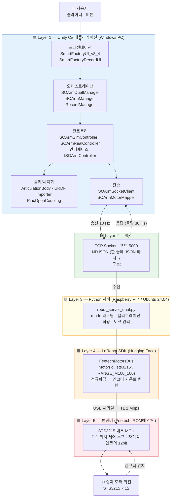
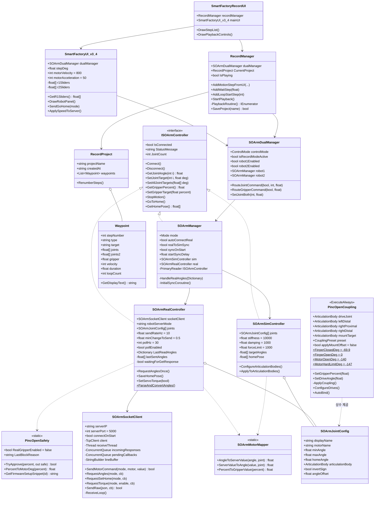
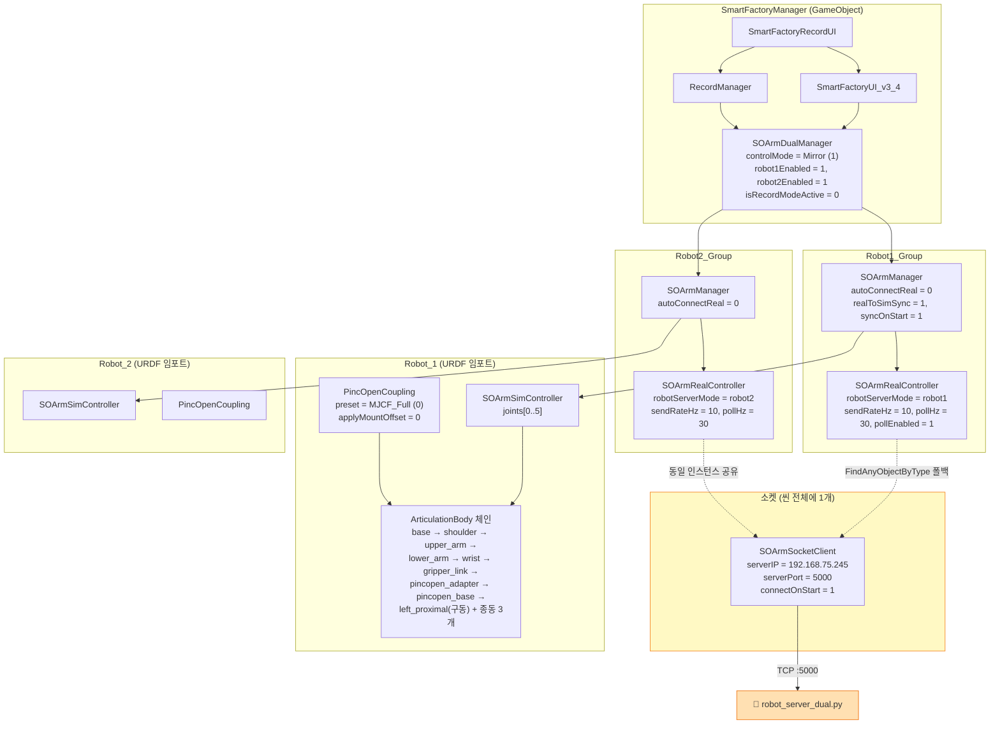
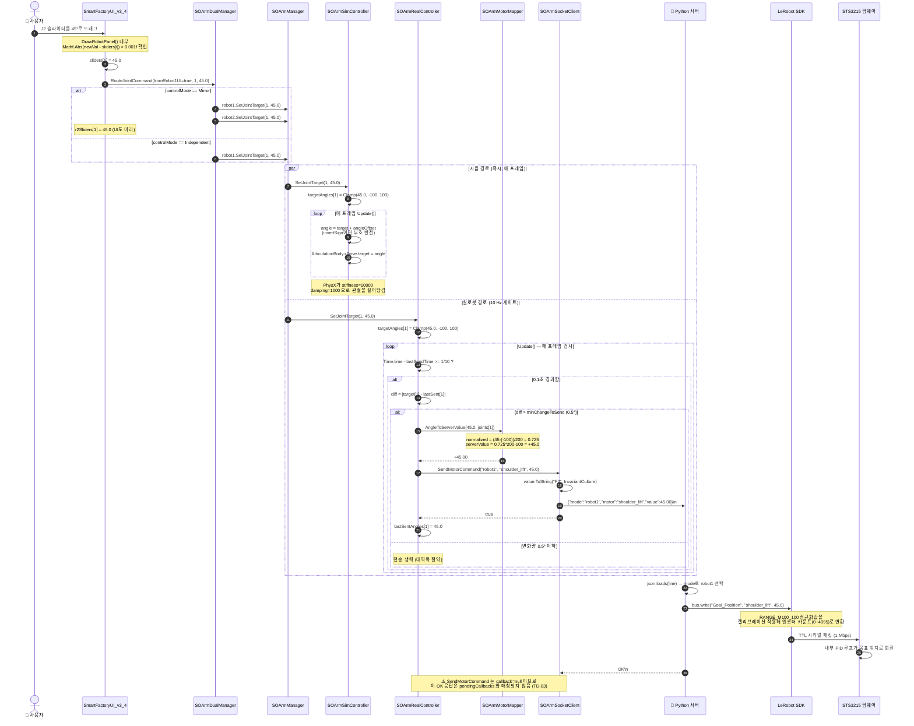
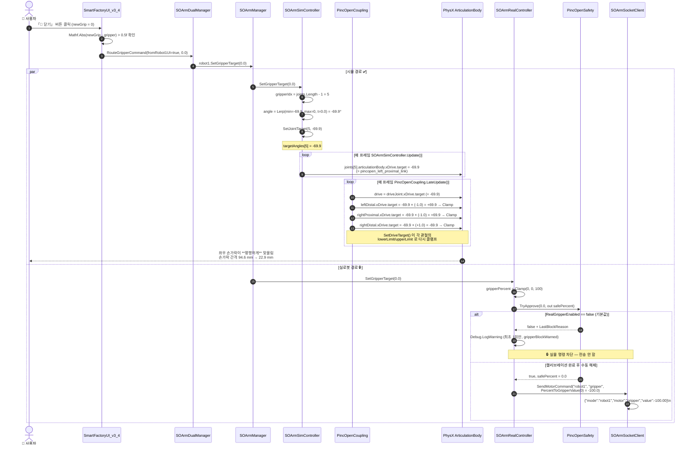
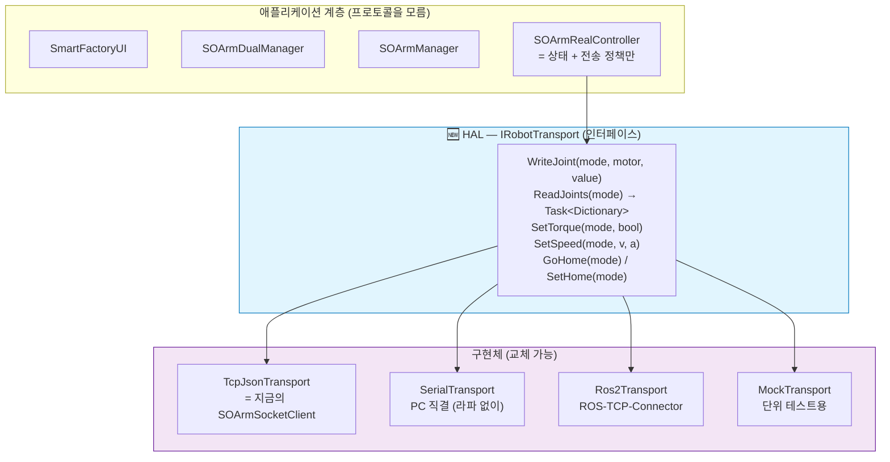

# 소프트웨어 아키텍처 — SO-ARM101 스마트팩토리

> **작성일: 2026-08-01**
> 이 문서는 **"슬라이더를 움직였을 때 진짜 모터가 돌기까지, 소프트웨어가 어떤 층을 거쳐 가는가"** 를 그림과 실제 클래스 이름으로 설명한 문서다.

---

## 0. 이 문서의 근거

모든 클래스명·필드명·수치는 아래 파일을 **직접 읽어서** 적었다.
확인 못 한 것은 **⚠️ 미확인** 으로 표시했다.

```
F:\UNITY\LeRobot\Assets\Script\*.cs        (14개)
F:\UNITY\LeRobot\Assets\Editor\*.cs        (3개)
F:\UNITY\LeRobot\Assets\Scenes\LeRobot.unity
F:\UNITY\LeRobot\Assets\SO101_unity\so101.urdf
F:\UNITY\LeRobot\docs\PINCOPEN_INTEGRATION.md
F:\UNITY\LeRobot\CLAUDE.md
C:\Users\snbco\Desktop\HANDOFF.md
```

---

## 1. 계층 구조 — 전체 그림

### 1.1 쉬운 설명

편지를 보내는 과정과 똑같다.

1. **내가 편지를 쓴다** — Unity에서 슬라이더를 움직임
2. **봉투에 넣어 우체통에 넣는다** — 각도를 JSON 한 줄로 만들어 TCP 소켓으로 보냄
3. **우체국이 받아서 분류한다** — 라즈베리파이의 Python 서버가 `mode` 를 보고 어느 로봇인지 고름
4. **집배원이 배달한다** — LeRobot SDK가 USB 시리얼로 모터에게 전달
5. **받는 사람이 읽는다** — STS3215 모터 안의 펌웨어가 해석해서 실제로 회전

### 1.2 계층 다이어그램



---

## 2. ⭐ 우리가 만든 것 / 가져다 쓴 것 / 안 건드리는 것

> 이 구분은 프로젝트 초기에 가장 많이 헷갈렸던 부분이다 (`HANDOFF` §3).
> **우리는 펌웨어도 SDK도 만들지 않았다.**

```mermaid
flowchart LR
    subgraph MADE["✍️ 우리가 만든 것"]
        M1["Unity C# 앱<br/>Assets/Script/ 14 파일<br/>Assets/Editor/ 3 파일"]
        M2["Python 서버<br/>robot_server_dual.py"]
        M3["통합 URDF<br/>so101.urdf<br/>+ PincOpen 6링크 삽입"]
    end

    subgraph USED["📦 가져다 쓴 것"]
        U1["LeRobot SDK<br/>Hugging Face"]
        U2["Unity URDF Importer<br/>Unity Robotics Hub"]
        U3["PincOpen 메시 6종<br/>Pollen Robotics<br/>CC BY-SA 4.0"]
        U4["SO-ARM101 원본 URDF<br/>so101_new_calib<br/>onshape-to-robot 생성"]
    end

    subgraph NEVER["🚫 안 건드리는 것"]
        N1["STS3215 펌웨어<br/>Feetech가 칩에 구워놓음"]
        N2["Unity 물리엔진<br/>PhysX ArticulationBody"]
        N3["Ubuntu / 커널 드라이버<br/>USB CDC-ACM"]
    end

    MADE --> USED --> NEVER

    style MADE fill:#c8e6c9,stroke:#2e7d32
    style USED fill:#ffe0b2,stroke:#ef6c00
    style NEVER fill:#ffcdd2,stroke:#c62828
```



### 2.1 상세 구분표

| 구분 | 항목 | 근거 |
|---|---|---|
| ✍️ 자작 | `Assets/Script/*.cs` 14개 (`SOArmControl` 네임스페이스) | 파일 실측 |
| ✍️ 자작 | `Assets/Editor/*.cs` 3개 (`SOArmControl.EditorTools`) | 파일 실측 |
| ✍️ 자작 | `robot_server_dual.py` | ⚠️ 라파에만 존재, 이 저장소에 없음 |
| ✍️ 자작 | `so101.urdf` 의 PincOpen 통합부 (L317~L511) | URDF 주석 |
| ✍️ 자작 | STL → DAE 변환 + collision 주석 처리 | `HANDOFF` §5 |
| 📦 차용 | LeRobot SDK (`huggingface/lerobot`) | `HANDOFF` §3 |
| 📦 차용 | `Unity.Robotics.UrdfImporter` | `PincOpenSetupMenu.cs` `using` 문 |
| 📦 차용 | PincOpen 메시 — `Interface_ARM100.stl` + MuJoCo PR #6 자산 5개 | `URDF` L320~322 |
| 📦 차용 | 원본 `so101_new_calib.urdf` (onshape-to-robot) | `URDF` L2~4 |
| 🚫 불가침 | STS3215 펌웨어 (PID 루프, 엔코더 처리) | `HANDOFF` §3 |
| 🚫 불가침 | Unity PhysX ArticulationBody 내부 solver | — |

### 2.2 "그럼 우리가 만든 건 뭔가"를 한 줄로

> **우리가 만든 것 = C# Unity 앱 + Python 서버, 딱 두 개.**
> 나머지는 이미 존재하는 것을 **정확히 이어 붙이는 일**이었다. — `HANDOFF` §3

---

## 3. 코드 인벤토리

### 3.1 런타임 스크립트 (`Assets/Script/`)

| # | 파일 | 종류 | 역할 | 핵심 심볼 |
|---|---|---|---|---|
| 1 | `SOArmJointConfig.cs` | 데이터 | 관절 1개의 설정 | `displayName`, `motorName`, `minAngle`, `maxAngle`, `homeAngle`, `articulationBody`, `invertSign`, `angleOffset` |
| 2 | `SOArmPresets.cs` | 정적 | 6축 기본 프리셋 | `GetDefault6Axis()` ⚠️ TD-08 |
| 3 | `ISOArmController.cs` | 인터페이스 | 시뮬/실로봇 공통 계약 | `SetJointTarget`, `SetGripperTarget`, `GoToHome`, `GetHomePose` 등 17개 멤버 |
| 4 | `SOArmMotorMapper.cs` | 정적 | 각도 ↔ 정규화값 변환 | `AngleToServerValue`, `ServerValueToAngle`, `PercentToGripperValue` |
| 5 | `SOArmSocketClient.cs` | MonoBehaviour | TCP 송수신 | `SendMotorCommand`, `RequestAngles`, `RequestSetHome`, `RequestTorque`, `SendRaw`, `ReceiveLoop` |
| 6 | `SOArmSimController.cs` | MonoBehaviour | 시뮬 제어 | `ConfigureArticulationBodies`, `ApplyToArticulationBodies` |
| 7 | `SOArmRealController.cs` | MonoBehaviour | 실로봇 제어 | `RequestAnglesOnce`, `SaveHomePose`, `SetServoTorque`, `ParseAndConvertAngles`, `OnAnglesReceived` |
| 8 | `SOArmManager.cs` | MonoBehaviour | 1대 통합 (Sim+Real) | `Mode{SimOnly,RealOnly,Mirror}`, `PrimaryReader`, `HandleRealAngles`, `InitialSyncCoroutine` |
| 9 | `SOArmDualManager.cs` | MonoBehaviour | 2대 통합 | `ControlMode{Independent,Mirror}`, `isRecordModeActive`, `robot1Enabled/2Enabled`, `RouteJointCommand`, `RouteGripperCommand` |
| 10 | `SmartFactoryUI_v3_4.cs` | MonoBehaviour | 메인 OnGUI | `DrawTopBar`, `DrawRobotPanel`, `DrawSetHomeDialog`, `ApplySpeedToServer`, `SendGoHome` |
| 11 | `SmartFactoryRecordUI.cs` | MonoBehaviour | 녹화 UI | `DrawStepList`, `DrawPlaybackControls`, `DrawLoadDialog` |
| 12 | `RecordManager.cs` | MonoBehaviour | 녹화/재생 로직 | `AddMotionStepFromUI`, `PlaybackRoutine`, `SaveProject`, `LoadProject` |
| 13 | `RecordProject.cs` | 데이터 | 프로젝트 직렬화 | `waypoints`, `RenumberSteps`, `Touch` ⚠️ 주석 인코딩 깨짐 (TD-09) |
| 14 | `Waypoint.cs` | 데이터 | 스텝 1개 | `type{motion,wait,loop_start,loop_end}`, `target`, `joints[6]`, `joints2[6]`, `loopCount` |
| + | `PincOpenCoupling.cs` | MonoBehaviour | 4절 링크 커플링 | `CouplingPreset`, `ApplyCoupling`, `SetGripperPercent`, `ConfigureDrives`, `AutoBind` |
| + | `PincOpenSafety.cs` | 정적 | 실물 명령 안전장치 | `RealGripperEnabled`, `TryApprove`, `GetFirmwareSetupSnippet` |

### 3.2 에디터 도구 (`Assets/Editor/`)

| 파일 | 메뉴 경로 | 역할 |
|---|---|---|
| `PincOpenSetupMenu.cs` | `Tools ▸ SO-ARM ▸ PincOpen 로봇 재임포트`<br/>`… 미리보기 씬 만들기`<br/>`… J6 슬롯 점검` | URDF 재임포트 (vHACD 회피), 커플링 자동 연결, 잘못된 J6 연결 감지 |
| `PincOpenMainSceneMigrator.cs` | `Tools ▸ SO-ARM ▸ 메인 씬에 PincOpen 이식` | 메인 씬의 순정 그리퍼 subtree 만 교체, J6 재배선, xDrive 직렬화 저장 |
| `PincOpenCapture.cs` | `… 그리퍼 장착 상태 캡처`<br/>`… 그리퍼 구동 자체검증` | 헤드리스 렌더링 검증, 자체검증/대칭/중력/배율비교/E2E 테스트 |

---

## 4. 컴포넌트 관계도

### 4.1 클래스 다이어그램



### 4.2 설계 패턴 관점

| 패턴 | 적용 위치 | 효과 |
|---|---|---|
| **Strategy / 공통 인터페이스** | `ISOArmController` | UI가 "시뮬인지 실물인지" 몰라도 같은 방식으로 명령 가능 |
| **Composite** | `SOArmManager` 가 `ISOArmController` 를 구현하면서 내부에 `sim`+`real` 두 개를 보유 | 1대 = 부품 2개짜리 합성체. 다시 `SOArmDualManager` 가 2대를 합성 |
| **Facade** | `SOArmDualManager.RouteJointCommand()` | UI는 모드 분기를 몰라도 됨 |
| **Observer** | `SOArmRealController.OnAnglesReceived` → `SOArmManager.HandleRealAngles` | 폴링 결과를 느슨하게 전파 |
| **Producer-Consumer** | `ReceiveLoop`(백그라운드 스레드) → `ConcurrentQueue` → `Update()`(메인 스레드) | Unity API 스레드 제약 회피 |
| **Command / Memento** | `Waypoint` + `RecordProject` | 자세를 데이터로 굳혀 저장·재생 |
| **Guard / Gatekeeper** | `PincOpenSafety.TryApprove()` | 위험 명령의 단일 통과 지점 (⚠️ 우회로 존재 — §10 TD-04) |

---

## 5. 씬 배선도 (실제 `LeRobot.unity` 확인값)

> ⭐ **중요한 발견:** 씬에 `SOArmSocketClient` 는 **딱 1개**만 존재한다 (`SCENE` L10623).
> 두 `SOArmRealController` 가 이 하나를 공유하며, 구분은 **JSON의 `mode` 필드로만** 한다.
> `SOArmRealController.Awake()` 의 `FindAnyObjectByType<SOArmSocketClient>()` 폴백 덕분에 자동 연결된다.



### 5.1 씬에서 확인한 관절 범위 (4개 배열 전부 일치)

`SCENE` 의 `SOArmSimController × 2` + `SOArmRealController × 2` = **12 관절 슬롯 × 2 = 총 24개 값**을 확인했고,
아래 값으로 **전부 통일**되어 있다. (`PINCOPEN_INTEGRATION` §9의 Sim↔Real 불일치 버그 수정이 실제로 반영됨)

| 인덱스 | motorName | minAngle | maxAngle | URDF 원본 (rad) | 환산 |
|---|---|---:|---:|---|---|
| 0 | `shoulder_pan` | −110 | 110 | ±1.91986 | ±110.00° ✅ |
| 1 | `shoulder_lift` | −100 | 100 | ±1.74533 | ±100.00° ✅ |
| 2 | `elbow_flex` | −96.8 | 96.8 | ±1.69 | ±96.83° ✅ |
| 3 | `wrist_flex` | −95 | 95 | ±1.65806 | ±95.00° ✅ |
| 4 | `wrist_roll` | −157.2 | 162.8 | −2.74385 ~ 2.84121 | −157.21° ~ 162.79° ✅ |
| 5 | `gripper` | **−69.9** | **0** | −1.22 ~ 0 | −69.90° ~ 0° ✅ |

> ⚠️ 단, 코드 폴백인 `SOArmPresets.GetDefault6Axis()` 는 J1~J5가 **전부 ±110°** 로 되어 있어 위와 다르다.
> 씬에 값이 저장돼 있으면 프리셋은 쓰이지 않으므로 현재는 무해하나, 3번째 로봇을 추가하면 잘못된 범위가 들어간다. (TD-05)

---

## 6. 시퀀스 다이어그램 (a) — 슬라이더 → 실로봇 명령

### 6.1 쉬운 설명

슬라이더를 아무리 빠르게 흔들어도, **초당 10번만** 명령이 나간다.
그리고 **0.5° 미만으로만 움직였으면 아예 안 보낸다.**
이 두 가지가 서버 파서를 보호하는 안전판이다.

### 6.2 다이어그램



### 6.3 이 경로에서 확인된 수치 요약

| 항목 | 값 | 출처 |
|---|---|---|
| UI 변화 감지 임계값 | 0.001° | `SmartFactoryUI_v3_4.DrawRobotPanel()` |
| 전송 주기 | 10 Hz (`sendRateHz`) | `SCENE` L1029 / L9896 |
| 전송 최소 변화량 | 0.5° (`minChangeToSend`) | `SOArmRealController` 기본값 |
| 첫 전송 강제 | `lastSentAngles[i] = float.NaN` → `diff = float.MaxValue` | `SOArmRealController.Awake()` |
| 숫자 포맷 | `"F2"` + `InvariantCulture` | `SOArmSocketClient.SendMotorCommand()` |
| 시뮬 드라이브 | stiffness 10000 / damping 1000 / forceLimit 1000 | `SOArmSimController`, `SCENE` L1146 |

---

## 7. 시퀀스 다이어그램 (b) — 그리퍼 개폐 시 커플링 전파

### 7.1 쉬운 설명 — 왜 스크립트가 필요한가

PincOpen은 **평행 4절 링크(parallel four-bar linkage)** 다.
막대 4개를 사각형으로 이어 붙여, 하나만 돌리면 나머지가 **기계적으로 따라 움직이는** 구조다.
이런 구조를 **폐루프(closed-loop)** 라고 한다.

문제는 **URDF가 폐루프를 표현하지 못한다**는 것이다.
URDF는 나무 구조(트리)만 표현할 수 있어서, "이 관절과 저 관절이 물리적으로 묶여 있다"를 쓸 수 없다.

그래서 `PincOpenCoupling` 이 **하드웨어가 알아서 해주던 종동 관계를 소프트웨어가 대신 계산**한다.
(펌웨어 엔지니어링으로 치면, 기구가 해주던 일을 코드로 옮겨 적은 것)

### 7.2 확정된 배율과 부호

```
구동축 θ = pincopen_left_proximal (URDF 조인트 이름 "gripper", 모터 ID 6)

left_distal    = θ × (−1.0)
right_proximal = θ × (−1.0)
right_distal   = θ × (+1.0)
```

**왜 ×1.0 인가 (ROS2 문헌은 ×0.5 라고 적혀 있음):**
두 문헌은 **기준 관절이 다를 뿐** 모순이 아니다.
ROS2 xacro는 네 관절을 전부 *모터축* 기준으로 ±0.5배로 적는데,
이 프로젝트의 URDF 구동축은 모터축이 아니라 **왼쪽 proximal** (= ROS2의 `base_link_to_left_arm`)이고
이 관절 자체가 이미 모터의 −0.5배다. 모터 `M = −2θ` 로 환산하면 ×1.0의 (−1, −1, +1)이 된다.
**렌더링 교차검증에서도 ×1.0에서만 손가락 패드가 서로 평행하게 맞물렸다.** (`PincOpenCoupling.cs` 클래스 주석)

### 7.3 다이어그램



### 7.4 코드 자체검증 결과 (`Tools ▸ SO-ARM ▸ 그리퍼 구동 자체검증`)

`PINCOPEN_INTEGRATION` §7에 기록된 실측값이다. 언제든 재실행 가능하다.

| 입력 % | 구동축 각도 | 손가락 간격 |
|---:|---:|---:|
| 100 % | 0.0° | 94.6 mm |
| 75 % | −17.5° | 74.4 mm |
| 50 % | −35.0° | 53.9 mm |
| 25 % | −52.4° | 35.2 mm |
| 0 % | −69.9° | 22.9 mm |
| 150 % (범위 초과) | **0.0° 로 잘림** ✅ | — |

> 💡 관절이 전혀 안 움직이면 십중팔구 `stiffness = 0` 이다.
> URDF 임포터가 limit만 채우고 드라이브를 안 켜는 경우가 있어 `ConfigureDrives()` 가 채워준다.
> 펌웨어로 치면 **레지스터 값만 쓰고 토크를 안 켠 상태**와 같다.

---

## 8. 통신 프로토콜 명세

### 8.1 전송 규격

| 항목 | 값 |
|---|---|
| 방식 | TCP Socket (클라이언트 = Unity, 서버 = 라즈베리파이) |
| 포트 | **5000** |
| 인코딩 | UTF-8 |
| 프레이밍 | **NDJSON** (Newline Delimited JSON) — 한 줄에 JSON 객체 하나, `\n` 으로 구분 |
| 수신 처리 | `StringBuilder lineBuffer` 에 누적 후 `'\n'` 단위로 분할 (부분 수신 대응) |
| 응답 매칭 | **FIFO 큐** (`pendingCallbacks`). 요청 ID 없음 — 서버가 보낸 순서대로 온다고 가정 |
| 동시성 | `lock (writeLock)` 으로 송신 직렬화, 콜백 등록 → send 순서 보장 |

### 8.2 왜 NDJSON 인가

JSON은 그 자체로 **어디서 끝나는지** 알려주지 않는다.
TCP는 바이트 스트림이라 `{"a":1}{"b":2}` 가 한 번에 올 수도, `{"a":1}{"b` / `":2}` 로 쪼개져 올 수도 있다.
**개행(`\n`) 하나를 구분자로 약속**하면, 받는 쪽은 개행이 나올 때까지 모았다가 자르기만 하면 된다.
길이 헤더(Length-prefix)보다 단순하고, 사람이 눈으로 읽고 디버깅하기 쉽다.

### 8.3 Unity → 서버 메시지 (송신)

#### (1) 모터 위치 명령 — `type` 필드 **없음** (구버전 호환)

```json
{"mode": "robot1", "motor": "shoulder_lift", "value": 45.00}
```

| 필드 | 타입 | 값 | 설명 |
|---|---|---|---|
| `mode` | string | `robot1` / `robot2` / `mirror` | 제어 대상 |
| `motor` | string | `shoulder_pan`, `shoulder_lift`, `elbow_flex`, `wrist_flex`, `wrist_roll`, `gripper` | 모터 이름 |
| `value` | float | −100.00 ~ 100.00 | 정규화 위치값, 소수점 2자리 고정 |

> 생성 위치: `SOArmSocketClient.SendMotorCommand()`
> **응답 콜백을 등록하지 않는다** (`callback: null`).

#### (2) 현재 각도 요청

```json
{"type":"get","mode":"robot1"}
```

#### (3) 홈포즈 저장 (현재 자세를 새 0점으로)

```json
{"type":"set_home","mode":"robot1"}
```

#### (4) 토크 ON/OFF

```json
{"type":"torque","mode":"robot1","enable":false}
```

#### (5) 홈으로 이동

```json
{"type":"home","mode":"both"}
```

> 생성 위치: `SmartFactoryUI_v3_4.SendGoHome()` → `SendRaw()`

#### (6) 속도/가속도 설정

```json
{"type":"set_speed","mode":"both","velocity":800,"acceleration":50}
```

| 필드 | 범위 | UI 프리셋 |
|---|---|---|
| `velocity` | 0 ~ 3000 | 🐢 정밀 400 / 🚶 일반 800 / 🏃 빠름 1500 |
| `acceleration` | 1 ~ 254 | 🐢 30 / 🚶 50 / 🏃 100 |

> 생성 위치: `SmartFactoryUI_v3_4.ApplySpeedToServer()`. 0.5초 이내 중복 전송 차단.

### 8.4 서버 → Unity 메시지 (수신)

#### 각도 응답 (`get` 에 대한 응답)

Unity 파서(`SOArmRealController.ParseAndConvertAngles()`)가 기대하는 형태:

```json
{"ok":true,"robot1":{"shoulder_pan":12.3,"shoulder_lift":45.0,"elbow_flex":-3.1,"wrist_flex":0.0,"wrist_roll":8.8,"gripper":-100.0}}
```

- `mode` 문자열(`"robot1"`)을 키로 찾아, 그 뒤 첫 `{` 부터 **중괄호 깊이를 세어** 짝 맞는 `}` 까지를 잘라낸다.
- 잘라낸 내부를 `,` 로 나누고 `키:값` 파싱 → `float.TryParse(..., InvariantCulture)`
- 각 값은 **−100~100 정규화값**이므로 `ServerValueToAngle()` 로 각도(deg)로 되돌린다.

#### 성공/실패 응답

```json
{"ok":true}
{"ok":false,"error":"..."}
```

`SaveHomePose()` / `SetServoTorque()` 는 응답 문자열에 `"ok":true` 가 포함되는지 **문자열 검색**으로 판정한다.

#### 단순 확인 응답

`HANDOFF` §4: 서버는 모터 명령 수행 후 `OK\n` 을 보내지만 **Unity는 이 응답에 콜백을 걸지 않는다.**
⚠️ 이로 인한 큐 어긋남 위험은 §10 TD-03 참조.

### 8.5 전송률 정책과 그 근거

| 방향 | 주기 | 조건 | 근거 |
|---|---|---|---|
| Unity → 서버 (위치 명령) | **10 Hz** | 변화량 > 0.5° | 과속 시 서버 JSON 파서가 `Extra data` 예외 (`HANDOFF` §10) |
| Unity → 서버 (`get` 폴링) | **30 Hz** | 이전 응답 도착 후에만 (in-flight 1건) | `pollHz=30`, `waitingForGetResponse` |
| Unity → 서버 (`set_speed`) | 최대 2 Hz | 0.5초 디바운스 | `lastSpeedSendTime` |

**부하 계산 (최악)**
```
위치 명령 : 6 관절 × 10 Hz × 2 대 = 120 줄/s   (0.5° 필터로 실제는 훨씬 적음)
각도 폴링 :          30 Hz × 2 대 =  60 줄/s
────────────────────────────────────────────
합계                              ≈ 180 줄/s
```
한 줄 약 60~80바이트 → **약 12~15 KB/s**. 100 Mbps 유선/무선 LAN에서 여유롭다.
병목은 대역폭이 아니라 **1 Mbps TTL 시리얼 버스**와 **서버의 순차 처리**다.

---

## 9. 핵심 설계 결정 (Architecture Decision Records)

### ADR-01. 언어 경계를 프로세스 경계로 만든다 (TCP + JSON)

| | |
|---|---|
| **문제** | Unity 런타임은 C#만 실행할 수 있고, LeRobot SDK는 Python 전용이다. 한 프로세스에 넣을 수 없다. |
| **대안** | ① Python.NET 임베딩 ② gRPC ③ ROS2 브리지 ④ **TCP + JSON** |
| **결정** | ④ TCP + NDJSON |
| **근거** | Python.NET은 라즈베리파이 ARM에서 빌드 리스크가 크고, gRPC는 스키마 컴파일 단계가 추가된다. ROS2는 이 규모에 과하다. TCP+JSON은 `telnet`/`nc` 로 손으로 찔러볼 수 있어 디버깅이 압도적으로 쉽다. |
| **대가** | 스키마 검증이 없어 오타가 런타임에만 드러난다. 실제로 `{value:F2}` 사고가 났다 (NFR-06으로 대응). |

### ADR-02. so101.urdf 를 기구학의 단일 진실 공급원(SSoT)으로 삼는다

| | |
|---|---|
| **문제** | 그리퍼 장착 위치를 URDF에도, Unity 인스펙터에도 쓸 수 있다. 두 곳에 있으면 반드시 어긋난다. |
| **결정** | **URDF만 진실.** `PincOpenCoupling.applyMountOffset` 기본값 `false`, 씬 저장값도 `0`. |
| **운용** | 위치를 다시 맞출 때만 잠깐 켜고, `LogUrdfOrigin()` 으로 URDF 형식을 출력해 **URDF에 굽고 반드시 다시 끈다.** |
| **위험** | 켠 채로 값이 0이면 그리퍼가 손목 원점으로 튄다 → 코드·URDF·문서 3곳에 경고 명시. |
| **근거** | `URDF` L357, `PincOpenCoupling.cs` L86~96, `PINCOPEN_INTEGRATION` §6 |

### ADR-03. 제어 모드를 2개로 줄이고, 나머지를 직교 축으로 분리

| | |
|---|---|
| **문제** | 초기 `ControlMode` 는 `Robot1Only / Robot2Only / Independent / Mirror / Cooperative` 5개였다 (`CLAUDE.md` 기록). `Robot1Only` 는 "제어 방식"이 아니라 "어느 팔을 쓰나"인데 같은 enum에 섞여 있었다. |
| **결정** | **3개의 독립된 축으로 분리:**<br/>① `ControlMode { Independent, Mirror }` — 제어 *방식*<br/>② `robot1Enabled` / `robot2Enabled` — 채널 *on/off*<br/>③ `isRecordModeActive` — 녹화 *여부* |
| **효과** | 2 × 4 × 2 = 16가지 조합을 enum 5개가 아니라 3개 필드로 표현. "미러 + R2만 사용 + 녹화중" 같은 조합이 자연스럽게 가능해짐. |
| **근거** | `SOArmDualManager.cs` L12·L36~39 주석: *"예전엔 ControlMode가 연결까지 겸했는데, 제어 방식과 채널 on/off는 다른 축이라 분리함"* |
| **부작용** | `Cooperative` 가 사라져 FR-22가 미착수로 되돌아감. `CLAUDE.md` 의 5모드 기술은 구버전. |

### ADR-04. Sim / Real / Manager 가 모두 같은 인터페이스를 구현한다

| | |
|---|---|
| **결정** | `ISOArmController` 를 `SOArmSimController`, `SOArmRealController`, **그리고 `SOArmManager` 자신**이 구현 |
| **효과** | `SOArmManager` 는 인터페이스를 구현하면서 내부에 인터페이스 구현체 2개를 갖는 **Composite** 구조가 된다. UI는 "1대"를 다루는지 "Sim+Real 합성체"를 다루는지 몰라도 된다. |
| **읽기 전략** | `PrimaryReader` 프로퍼티가 모드에 따라 진실의 출처를 고른다.<br/>`RealOnly` → real / `Mirror` **&& real 연결됨** → real / 그 외 → sim |
| **근거** | `SOArmManager.cs` L43~51 |

### ADR-05. 소켓은 씬 전체에 하나만 둔다

| | |
|---|---|
| **사실** | 씬에 `SOArmSocketClient` 는 1개뿐 (`SCENE` L10623). Real 컨트롤러 2개가 공유한다. |
| **근거** | 서버가 **1 프로세스 / 1 포트에서 로봇 2대를 모두 관리**하므로 (`HANDOFF` §5), 연결도 하나면 충분하다. `mode` 필드가 라우팅을 담당한다. |
| **구현** | `SOArmRealController.Awake()` 의 3단 폴백: 인스펙터 지정 → `GetComponent` → `FindAnyObjectByType` |
| **부작용** | `SmartFactoryUI_v3_4.SendToServer()` / `SendSetHome()` 이 항상 `dualManager.robot1.real.socketClient` 를 쓴다. 소켓이 하나라 기능적으로는 문제없지만, **robot1이 null이면 robot2 명령까지 실패**한다 (TD-02). |

### ADR-06. 폐루프 구속은 스크립트로 대신 계산한다

| | |
|---|---|
| **문제** | PincOpen은 평행 4절 링크(폐루프). URDF는 트리만 표현 가능. |
| **대안** | ① ROS2 `mimic` 태그 ② PhysX 관절 구속 추가 ③ **스크립트 미러링** |
| **결정** | ③ — Unity URDF Importer가 `mimic` 을 반영하지 않고, PhysX 폐루프는 `ArticulationBody` 트리 제약과 충돌한다. |
| **구현** | `PincOpenCoupling.LateUpdate()` 에서 구동축 목표각 × 배율을 종동축 3개에 복사 |
| **철학** | 클래스 주석 그대로 — *"하드웨어가 알아서 해주던 종동 관계를 소프트웨어가 대신 계산해주는 것"* |

### ADR-07. 그리퍼 실물 명령은 기본 잠금(fail-safe)

| | |
|---|---|
| **문제** | STS3215는 위치 제어 모드에서 **토크 제한이 없다.** 물체를 물면 모터가 타거나 플라스틱이 부러진다. |
| **결정** | `PincOpenSafety.RealGripperEnabled = false` 를 기본값으로 두고, 4단계 절차를 마친 뒤에만 수동으로 켠다. |
| **설계 원칙** | **Fail-safe default** — 설정을 안 하면 위험한 게 아니라, 설정을 안 하면 아무것도 안 나간다. |
| **한계** | 게이트가 `SetGripperTarget()` 한 곳에만 있어 J6 각도 슬라이더 경로가 우회한다 (TD-04). |

### ADR-08. 마이그레이션은 "부분 교체 + 멱등"으로

| | |
|---|---|
| **문제** | URDF를 고쳐도 씬의 GameObject는 안 바뀐다. 통째로 재임포트하면 `SOArmManager`·`SocketClient`·UI의 인스펙터 연결이 전부 끊어진다. |
| **결정** | 임시 로봇을 하나 임포트해 **그리퍼 subtree만 떼어다 이식**한다. |
| **멱등성** | `pincopen_adapter_link` 존재 여부를 먼저 확인 → 있으면 이식 생략, 배선만 갱신. |
| **함정 대응** | `ArticulationBody.xDrive` 는 코드로 넣어도 씬 파일에 안 남는다(네이티브만 바뀜) → `SerializedObject` 로 `m_XDrive.stiffness` 등을 직접 써서 영속화 (`PersistDrive()`). |
| **근거** | `PincOpenMainSceneMigrator.cs` L11~20, L133~160 |

### ADR-09. 🔜 향후 제안 — HAL(하드웨어 추상화 계층) 분리

> **현재 미적용. 다음 단계 설계 제안이다.**

**현재의 문제:**
`SOArmRealController` 안에 세 가지 관심사가 섞여 있다.

1. 관절 상태 관리 (`targetAngles`, `homePose`)
2. 전송 정책 (10 Hz 게이트, 0.5° 필터, 30 Hz 폴링)
3. **프로토콜 지식** (`SendMotorCommand` 호출, JSON 응답 문자열 파싱)

3번 때문에 통신 방식을 바꾸려면 (예: ROS2, 또는 PC 직결 시리얼) 컨트롤러를 통째로 고쳐야 한다.

**제안 구조:**



**기대 효과**

| 효과 | 설명 |
|---|---|
| **교체 가능성** | 라즈베리파이를 빼고 PC 직결 시리얼로 가도 애플리케이션 코드 무수정 |
| **테스트 가능성** | `MockTransport` 로 실물·서버 없이 UI 로직 단위 테스트 |
| **응답 매칭 개선** | 인터페이스를 `Task` 기반으로 만들면 요청 ID를 넣어 FIFO 가정(TD-03)을 제거할 수 있다 |
| **안전 게이트 일원화** | HAL 진입점 한 곳에서 `PincOpenSafety` 를 강제하면 TD-04(우회 경로) 구조적으로 해결 |

**이 프로젝트에서의 의미:** ADR-01에서 "언어 경계를 프로세스 경계로" 만들었다면,
ADR-09는 "프로세스 경계를 **인터페이스 경계**로" 한 번 더 감싸는 것이다.

---

## 10. 알려진 기술 부채 (Technical Debt)

> 우선순위: 🔴 안전/기능 영향 → 🟡 유지보수 영향 → 🟢 정리 수준

| ID | 심각도 | 항목 | 위치 | 상세 | 권고 조치 |
|---|:---:|---|---|---|---|
| TD-01 | 🔴 | **비상 정지가 아무것도 안 한다** | `SOArmRealController.StopMotion()`<br/>`SOArmSimController.StopMotion()` | Real 쪽은 `Debug.Log` 한 줄, Sim 쪽은 빈 메서드. UI의 「⏸ 정지」·「⏸ 전체 정지」 버튼이 실효 없음 | 서버에 `{"type":"stop"}` 추가 + 현재 위치를 목표로 고정(freeze) |
| TD-02 | 🔴 | **UI의 서버 명령이 항상 robot1의 소켓을 통해 나간다** | `SmartFactoryUI_v3_4.SendToServer()` L295<br/>`SendSetHome()` L271 | `dualManager.robot1?.real` 을 하드코딩. `SendSetHome("robot2")` 도 robot1 유무를 검사한다. 소켓이 씬에 1개뿐이라 기능은 동작하지만, robot1이 없으면 robot2 명령까지 실패 | 소켓 참조를 `SOArmDualManager` 로 올리거나, `robotName` 에 맞는 매니저를 찾아 쓰도록 수정 |
| TD-03 | 🟡 | **응답 매칭이 FIFO 가정에 의존 + `OK` 응답 미소비** | `SOArmSocketClient` `pendingCallbacks` | 요청에 ID가 없다. `SendMotorCommand` 는 콜백을 등록하지 않는데 서버는 `OK\n` 을 보낸다(`HANDOFF` §4). 그 `OK` 가 `incomingResponses` 에 쌓였다가 **바로 뒤 `get` 요청의 콜백에 잘못 매칭될 수 있다** | 요청/응답에 `id` 필드 추가, 또는 서버가 `OK` 를 안 보내도록 통일 |
| TD-04 | 🔴 | **그리퍼 안전 게이트 우회 경로** | `SOArmRealController.Update()` 전송 루프 | J6 각도 슬라이더 → `SetJointTarget(5, …)` → `motorName="gripper"` 로 전송. `PincOpenSafety` 를 거치지 않음. 자세한 분석은 `REQUIREMENTS.md` §6.3 | 전송 루프에서 `motorName == "gripper"` 를 게이트 통과시키거나, UI에서 J6 슬라이더를 그리지 않음 |
| TD-05 | 🟡 | **`SOArmPresets` 의 관절 범위가 URDF와 불일치** | `SOArmPresets.cs` L16~40 | J1~J5가 전부 `±110°`. 씬 직렬화 값(±110/±100/±96.8/±95/−157.2~162.8)과 다름. 씬에 값이 있으면 프리셋은 안 쓰이므로 현재 무해하나, 새 로봇 추가 시 잘못된 범위 유입 | URDF 값으로 수정 |
| TD-06 | 🟡 | **`RecordManager.CaptureJoints()` 가 죽은 코드** | `RecordManager.cs` L384~404 | 항상 `0`(관절)과 `50f`(그리퍼)를 반환. 주석에도 *"실제 캡처는 UI에서 슬라이더 값을 전달받는 방식이 더 정확"* 이라 적혀 있고, 실제 경로는 `AddMotionStepFromUI()` 다. `AddMotionStep()` 을 호출하면 **전부 0인 스텝**이 저장된다 | `AddMotionStep()` / `CaptureJoints()` / `CaptureGripper()` 삭제 |
| TD-07 | 🟡 | **URDF 주석이 최신 값과 다름 (stale)** | `URDF` L325~330 | *"⚠️ 임시값 … limit ±1.25 rad — 커플링 배율 미확정"* 으로 적혀 있으나, 실제 리밋은 `-1.22 ~ 0` 으로 확정됐고 배율도 ×1.0으로 확정됨. `PINCOPEN_INTEGRATION` §6에도 같은 구버전 서술 잔존 | 주석 갱신 |
| TD-08 | 🟡 | **문서가 존재하지 않는 파일을 참조** | `PincOpenSafety.cs` L43·L67<br/>`PINCOPEN_INTEGRATION.md` L4·L110·L184<br/>`URDF` L335 | `docs/PINCOPEN.md` 를 5곳에서 참조하지만 파일이 없다. **실물 그리퍼 안전 절차의 원본**이라 공백이 위험 | 복구 또는 재작성 |
| TD-09 | 🟢 | **`RecordProject.cs` 주석 인코딩 깨짐** | `RecordProject.cs` 전체 | 한글 주석이 `Record ������Ʈ ��ü�� ǥ��` 처럼 깨져 있음 (CP949 ↔ UTF-8 혼선). 코드 동작에는 영향 없음 | UTF-8(BOM 포함)로 재저장 |
| TD-10 | 🟢 | **라즈베리파이 IP가 3곳에서 불일치** | `CLAUDE.md` / `HANDOFF` / `SOArmSocketClient.cs` 기본값 | `192.168.75.245` vs `192.168.45.18` vs `192.168.45.18`. 씬 실제값은 `192.168.75.245` | 설정 파일 1곳으로 일원화, 또는 mDNS(`apollon.local`) 사용 |
| TD-11 | 🟢 | **`SOArmRealController.articulationBody` 슬롯이 한 칸 밀려 있음** | `SCENE` | `PINCOPEN_INTEGRATION` §9 각주에 기록됨. **이 컴포넌트는 해당 필드를 사용하지 않으므로**(소켓 명령만 보냄) 무해 | 혼동 방지를 위해 비우기 |
| TD-12 | 🟢 | **서버 소스가 저장소 밖에 있음** | — | Unity 저장소 전체에 `.py` 파일 0개. 서버 동작을 코드로 검증할 수 없어 이 문서의 서버 측 서술이 전부 ⚠️ 미확인 | `robot_server_dual.py` 를 저장소에 포함 |
| TD-13 | 🟢 | **OnGUI 즉시 모드 UI의 한계** | `SmartFactoryUI_v3_4`, `SmartFactoryRecordUI` | 좌표를 픽셀 상수로 직접 계산(`GUI.Button(new Rect(x + dx * 3 + 82, y, 78, h), …)`). 항목 추가 시마다 좌표 재계산 필요, 매 프레임 GC 할당 발생 | UI Toolkit(UXML/USS) 또는 uGUI 전환 |

---

## 11. ⚠️ 미확인 항목

| 항목 | 왜 확인 못 했나 |
|---|---|
| `robot_server_dual.py` 의 실제 동작 | 저장소에 소스 없음 (TD-12) |
| 서버가 `get` / `set_home` / `torque` / `set_speed` / `home` 을 처리하는지 | 위와 동일 |
| `set_home` 다이얼로그가 안내하는 "캘리브 파일 자동 백업 / autocorrect / 자동 복구" | UI 문구에만 존재. 서버 구현 미확인 |
| 양방향 동기화(FR-12)의 **실물 검증** | 코드 경로는 완결됐으나, 실제로 시뮬-실물이 일치하는지 확인 기록 없음 |
| `mirror` 모드를 서버가 어떻게 처리하는지 | 프로토콜 명세에는 있으나 서버 구현 미확인 |
| 손목 카메라 스트리밍 | 미구현 (FR-37) |

---

## 12. 관련 문서

| 문서 | 내용 |
|---|---|
| `docs/REQUIREMENTS.md` | 요구사항 ID·구현 상태·안전 요구사항·제약사항 |
| `docs/HW_ARCHITECTURE.md` | 물리 구성, 모터 사양, 기구 치수, 전원·배선, 안전 한계 |
| `docs/PINCOPEN_INTEGRATION.md` | PincOpen 통합 확정 기록 (좌표 유도 근거, 검증 결과) |
| `docs/PINCOPEN.md` | ⚠️ **부재** (TD-08) |
