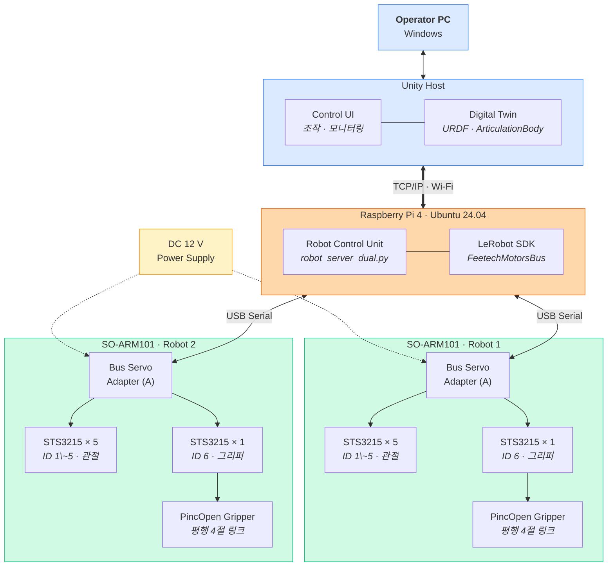

# H/W Architecture

| 과정명 | Unity 활용 DT 로봇 분야 개발자 양성과정 1기 |
|---|---|
| **프로젝트명** | SO-ARM101 듀얼 로봇팔 디지털 트윈 |
| **작성자** | 김애리 |

---

## 구성도

---

## 구성 요소

| 계층 | 구성 요소 | 사양 | 수량 |
|---|---|---|---|
| 조작 | Operator PC | Windows / Unity 6000.4.3f1 | 1 |
| 제어 | Raspberry Pi 4 | 4 GB RAM / Ubuntu 24.04 | 1 |
| 인터페이스 | Waveshare Bus Servo Adapter (A) | USB ↔ TTL Half-duplex | 2 |
| 구동 | Feetech STS3215 | 12 V / 1:345 감속 / 4096 tick·rev | 12 |
| 말단장치 | PincOpen Gripper | 평행 4절 링크 + 캠 | 2 |
| 전원 | DC Power Supply | 12 V | 1 |

---

## 통신 경로

| 구간 | 방식 | 속도 | 비고 |
|---|---|---|---|
| Unity ↔ Raspberry Pi | TCP/IP (Wi-Fi) | 지령 10 Hz / 조회 30 Hz | JSON, 포트 5000 |
| Raspberry Pi ↔ Adapter | USB Serial | 1 Mbps | `serial-by-id` 로 식별 |
| Adapter ↔ 모터 | TTL Half-duplex 데이지체인 | 1 Mbps | Protocol 0 |

> 로봇 2대는 **서로 다른 USB 포트**에 연결된다.
> 장치명(`/dev/ttyUSB0`)은 재부팅 시 뒤바뀔 수 있으므로,
> `/dev/serial/by-id/usb-1a86_USB_Single_Serial_...` 경로로 고정 식별한다.
> 이 조치가 없으면 로봇1 명령이 로봇2로 나가는 사고가 난다.

---

## 관절 구성

로봇 1대당 6축. 모터는 데이지체인으로 1개 버스에 물린다.

| ID | 관절 | 역할 | 중력 부하 |
|---|---|---|---|
| 1 | `shoulder_pan` | 베이스 회전 | 없음 (수직축) |
| 2 | `shoulder_lift` | 어깨 | **큼** (팔 전체) |
| 3 | `elbow_flex` | 팔꿈치 | 큼 (전완 + 그리퍼) |
| 4 | `wrist_flex` | 손목 상하 | 작음 (그리퍼) |
| 5 | `wrist_roll` | 손목 회전 | 없음 (툴축) |
| 6 | `gripper` | 그리퍼 개폐 | 없음 |

> **중력 부하 칸은 직접교시 설계의 근거다.**
> 부하가 없는 1·4·5번만 토크를 해제하면, 팔이 서 있는 채로 손으로 밀 수 있다.
> 2·3번을 함께 끄면 팔이 그대로 주저앉는다.

---

## 전원 설계 유의사항

⚠️ **모터 전원과 신호선은 별개다.**
USB만 연결하면 모터가 응답은 해도 움직이지 않는다.
12 V 전원이 어댑터에 들어가야 구동된다.

⚠️ **토크가 걸린 상태로 방치하면 모터가 발열한다.**
특히 `shoulder_lift` 는 정지 상태에서도 팔 무게를 계속 든다.
장시간 시연 시 온도를 확인해야 한다.

⚠️ **전원을 끄면 팔이 낙하한다.**
작업 종료 시에는 팔을 낮은 자세로 접은 뒤 전원을 차단한다.
