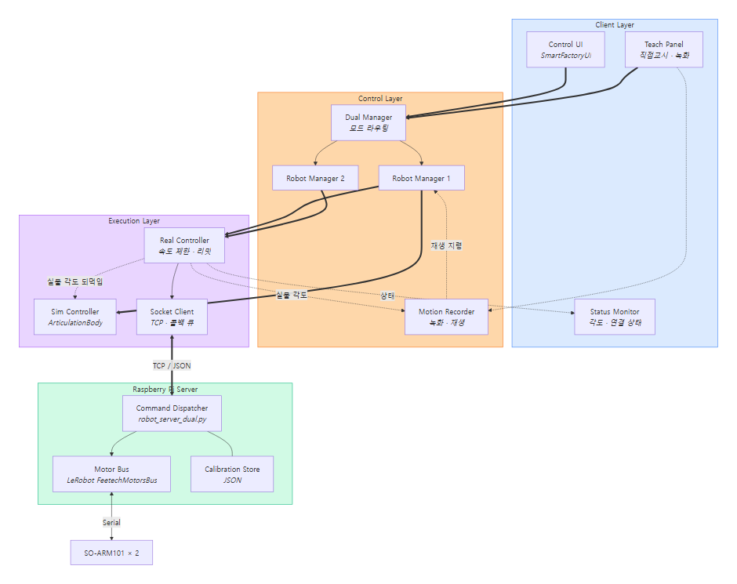
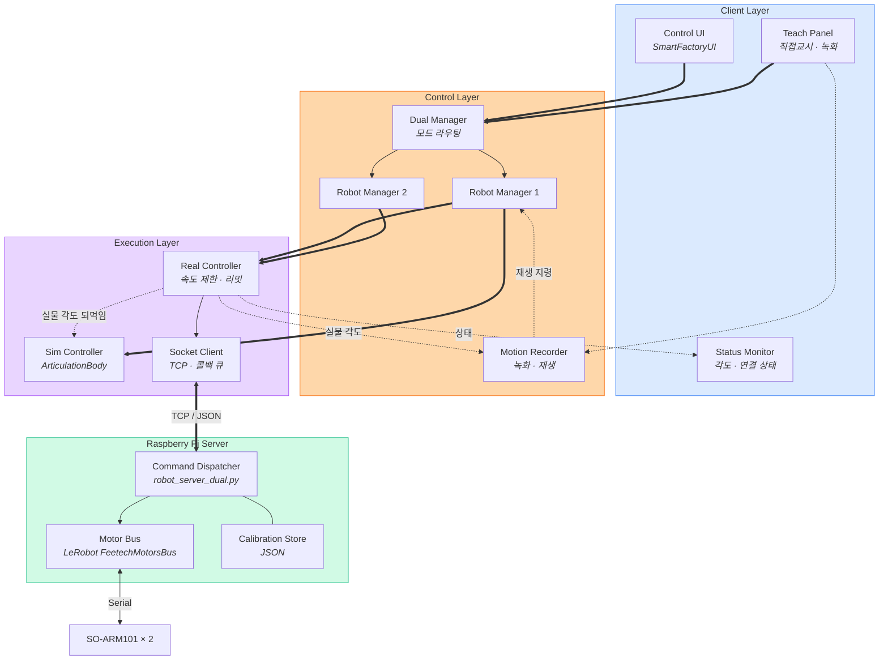

# S/W Architecture

| 과정명 | Unity 활용 DT 로봇 분야 개발자 양성과정 1기 |
|---|---|
| **프로젝트명** | SO-ARM101 듀얼 로봇팔 디지털 트윈 |
| **작성자** | 김애리 |

---

## 구성도



> 편집용 원본: [`SW_ARCHITECTURE.drawio`](SW_ARCHITECTURE.drawio) — draw.io / diagrams.net 에서 열어 수정

<details><summary>다이어그램 소스 (mermaid)</summary>



</details>

**범례**

| 표기 | 뜻 |
|---|---|
| ══▶ | 지령 (사용자 → 로봇) |
| ⋯▶ | 상태 되먹임 (로봇 → 화면) |
| ── | 동일 계층 내부 연결 |

---

## 계층 구성

| 계층 | 책임 | 주요 모듈 |
|---|---|---|
| Client | 입력 수집, 상태 표시 | `SmartFactoryUI_v3_4` |
| Control | 모드 판단, 명령 라우팅, 녹화 | `SOArmDualManager` / `SOArmManager` / `SOArmMotionRecorder` |
| Execution | 각도 변환, 속도 제한, 통신 | `SOArmSimController` / `SOArmRealController` / `SOArmSocketClient` |
| Server | 명령 해석, 모터 구동, 캘리브레이션 | `robot_server_dual.py` + LeRobot SDK |

> **왜 Sim 과 Real 을 같은 인터페이스(`ISOArmController`)로 두었나**
> 상위 계층이 "지금 실물이 붙어 있는지"를 몰라도 되게 하기 위해서다.
> 실물이 없으면 Sim 만 움직이고, 있으면 둘 다 움직인다.
> 덕분에 로봇 없이도 UI 와 제어 로직을 개발할 수 있다.

---

## 통신 프로토콜

TCP 소켓, **한 줄 = 한 JSON 메시지** (`\n` 구분), 포트 5000.

| `type` | 용도 | 필드 | 응답 |
|---|---|---|---|
| *(생략)* | 관절 이동 | `mode`, `motor`, `value` | 없음 |
| `get` | 현재 각도 조회 | `mode` | 각도 |
| `teach` | 직접교시 모드 | `mode`, `enable` | 관절별 상태 |
| `torque` | 토크 ON/OFF | `mode`, `enable` | 성공 여부 |
| `set_speed` | 속도 · 가속도 | `mode`, `velocity`, `acceleration` | 성공 여부 |
| `home` | 홈 자세 이동 | `mode` | 성공 여부 |
| `set_home` | 현재 자세를 0점으로 | `mode`, `confirm` | 성공 여부 |

`mode` : `robot1` / `robot2` / `both` / `mirror`
`motor` : `shoulder_pan` / `shoulder_lift` / `elbow_flex` / `wrist_flex` / `wrist_roll` / `gripper`
`value` : −100 \~ 100 (정규화 위치)

> **`set_home` 에만 `confirm` 이 있는 이유**
> 0점을 바꾸면 이후 모든 각도의 의미가 달라진다. 되돌리기 어려운 조작이다.
> 실수로 한 글자 잘못 보내 좌표계가 통째로 어긋나는 것을 막기 위해 확인 필드를 뒀다.

---

## 데이터 흐름

**지령 (사용자 → 로봇)**

```
슬라이더 입력
  → 모드 판단        (독립 / 미러, 채널 on/off)
  → 소프트 리밋 적용
  → 속도 제한 적용    (관절 40°/s)
  → 각도 → 정규화 변환
  → TCP 전송         (10 Hz)
  → 서버 → LeRobot → 모터
```

**되먹임 (로봇 → 화면)**

```
모터 현재 위치
  → 서버 조회 응답
  → 정규화 → 각도 변환
  → 화면 모델 반영    (30 Hz)
  → 녹화 중이면 시각과 함께 기록
```

> **되먹임이 지령보다 빠른 이유 (30 Hz vs 10 Hz)**
> 화면이 실물보다 늦으면 사용자는 이미 지나간 상태를 보고 판단하게 된다.
> 지령은 사람 손의 속도를 넘을 필요가 없지만, 표시는 실물을 놓치면 안 된다.

---

## 상태 관리

| 상태 | 보유 | 영향 |
|---|---|---|
| 제어 모드 | Dual Manager | 지령 라우팅 대상 |
| 채널 활성화 | Dual Manager | 명령 전송 여부 |
| 비상 정지 | Dual Manager + 각 Controller | 모든 지령 차단 |
| 교시 모드 | Real Controller + 서버 | 토크 해제 · 목표 추종 |
| 쓰기 허용 | Real Controller | 실물 자세 수신 전 지령 차단 |
| 녹화 · 재생 | Motion Recorder | 궤적 수집 · 재현 |

> **`쓰기 허용` 이 필요한 이유**
> Unity 는 실행 직후 모델이 0° 자세에서 시작한다.
> 그 상태로 지령을 내보내면 실물이 화면을 따라 0° 로 끌려간다.
> 순서가 거꾸로다 — **실물이 진실이고 화면이 따라와야 한다.**
> 그래서 실물 자세를 한 번 읽기 전까지 모든 지령을 막는다.

---

## 예외 처리

| 상황 | 처리 |
|---|---|
| 조회 응답 유실 | 1 초 후 재요청 |
| 연결 끊김 | 자동 재연결, 수신 스레드 종료 시 상태 갱신 |
| 실물 미연결 | Sim 단독 동작, 지령은 보류 |
| 비상 정지 중 | 지령 차단, 조회는 유지 (상태 표시를 위해) |
| 리밋 초과 지령 | 소프트웨어 → URDF → 모터 펌웨어 3중 차단 |
| 재생 중 비상 정지 | 재생 즉시 중단 |

> **비상 정지 중에도 조회를 멈추지 않는 이유**
> 멈춘 뒤에야말로 현재 상태를 확인해야 한다.
> 조회까지 끊으면 화면이 정지 직전 값에 얼어붙어, 실제로 멈췄는지 알 수 없다.
